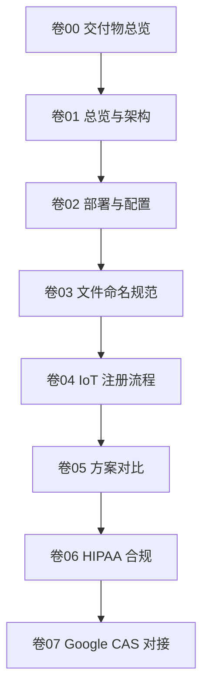

# 📦 卷 00：WiseFido CA 设计说明书 — 交付物总览

**版本：v1.0**
**发布日期：2025-10-04**
**编制单位：WiseFido Engineering & Compliance Department**

---

## 🧭 0.1 文件定位

本文件为 **《WiseFido CA 设计说明书》** 系列文档体系的主索引与执行路线图，用于指导项目团队在实施 **WiseFido 自建 CA 服务器（基于 HashiCorp Vault）** 过程中的文件结构、依赖关系与执行顺序。

> 所有文件与目录均采用**固定编号体系**，确保在 VS Code、GitHub、CLI 浏览器中按顺序显示与执行。
>
> 本体系遵循 **工程化交付逻辑**，从架构 → 部署 → 注册 → 合规 → 扩展，形成完整闭环。

---

## 🧱 0.2 当前确认的基础信息

| 项目要素                   | 内容                                                                               |
| -------------------------- | ---------------------------------------------------------------------------------- |
| **CA 方案**          | HashiCorp Vault 自建 CA（Root + Intermediate 架构）                                |
| **服务器系统**       | Ubuntu Server 24.04 LTS (64-bit)                                                   |
| **公网 IP**          | 23.170.40.60                                                                       |
| **部署方式**         | Docker Compose                                                                     |
| **公网域名**         | `ca.wisefido.work`                                                               |
| **架构选型**         | 方案 B：公网域名 + Vault 原生 HTTPS + Docker + 自建 Root/Intermediate CA           |
| **未来扩展方向**     | 与 Google Cloud CA Service 对接（Subordinate 模式）                                |
| **主要用途**         | IoT 设备与服务器的身份认证、mTLS 加密通信与信任管理                                |
| **文件体系编号规则** | 两位编号前缀 + 下划线 + 英文名称，例如：`03_deploy/`、`02_config/01_vault.hcl` |

---

## 🗂️ 0.3 文档体系结构（编号化）

> 本设计说明书由 **七个主卷 + 一份交付物总览（本卷）** 组成。
>
> 每卷为独立 Markdown 文件，可单独导出 PDF 或在 VS Code 中浏览。
>
> 所有表格采用蓝灰主题（#DCE6F1），符号体系统一为（✔ ⚠ ✘ ★）。

| 卷号            | 文件名（带编号）                                   | 内容定位                                        | 主要受众             |
| --------------- | -------------------------------------------------- | ----------------------------------------------- | -------------------- |
| **卷 00** | `00_WiseFido_CA_交付物总览.md`                   | 文件索引、依赖说明、执行路线图                  | 所有人               |
| **卷 01** | `01_WiseFido_CA_总览与架构说明.md`               | 系统架构、信任链、分层关系图                    | 架构师 / 决策层      |
| **卷 02** | `02_WiseFido_CA_部署与配置手册.md`               | Docker Compose + Vault 实际部署操作（含脚本）   | 运维 / DevOps 工程师 |
| **卷 03** | `03_WiseFido_CA_证书体系与文件命名规范.md`       | 文件结构、命名规则、目录树                      | 全体工程师           |
| **卷 04** | `04_WiseFido_IoT_设备注册与证书签发流程.md`      | IoT 设备 CSR 生成、签发、验证                   | 嵌入式 / 生产部门    |
| **卷 05** | `05_WiseFido_CA_方案对比与选型说明.md`           | 三方案（A/B/C）对比与选型依据                   | 架构组 / 管理层      |
| **卷 06** | `06_WiseFido_CA_HIPAA合规与风险评估.md`          | 自建 CA vs 阿里云 vs Google Cloud CA 合规性分析 | 法务 / 安全合规组    |
| **卷 07** | `07_WiseFido_CA_未来扩展与Google_CAS对接建议.md` | Google CAS 迁移路径与信任链衔接                 | 战略规划组           |

> 📘 每卷中包含表格、架构图、配置文件、脚本或流程图，所有编号前缀固定，不可更改。

---

## 📑 0.4 执行顺序与依赖关系

以下为 WiseFido CA 文档执行逻辑图（Mermaid 兼容版）：

## 📘 文档执行阶段表

| 阶段             | 目标                    | 依赖前序    |
| ---------------- | ----------------------- | ----------- |
| **阶段 1** | 架构确认（卷01）        | 卷00        |
| **阶段 2** | 实际部署（卷02 + 卷03） | 卷01        |
| **阶段 3** | IoT 注册验证（卷04）    | 卷02 + 卷03 |
| **阶段 4** | 方案评估与选型（卷05）  | 卷01~卷04   |
| **阶段 5** | 合规与风险分析（卷06）  | 卷05        |
| **阶段 6** | 云扩展规划（卷07）      | 卷06        |

---

> 说明：
>
> - 卷 00 作为索引文件，必须在整个目录结构最上层；
> - 后续所有卷输出时，文件路径与编号不再修改

---

## ⚙️ 0.5 部署脚本与配置文件约定（编号化）

| 文件类别             | 目录（带编号）                                  | 命名规则（带编号）                                              | 说明                 |
| -------------------- | ----------------------------------------------- | --------------------------------------------------------------- | -------------------- |
| Shell 脚本           | `04_scripts/`                                 | `01_setup_init_vault.sh` … `06_setup_test_and_validate.sh` | 按数字顺序执行       |
| Compose 模板         | `03_deploy/`                                  | `01_docker-compose.yml`                                       | Vault 主服务启动模板 |
| Vault 配置           | `02_config/`                                  | `01_vault.hcl`                                                | Vault 监听与存储配置 |
| Root CA 文件         | `05_opt/01_wisefido-ca/01_root/`              | `WiseFido_RootCA_<year>.{crt,key}`                            | 离线存储             |
| Intermediate CA 文件 | `05_opt/01_wisefido-ca/02_intermediate/`      | `WiseFido_IntCA_<year>.{crt,key,csr}`                         | 在线签发             |
| 设备证书             | `05_opt/01_wisefido-ca/03_issued/01_devices/` | `device_<serial>.crt`                                         | IoT设备身份          |
| 吊销列表             | `05_opt/01_wisefido-ca/04_crl/`               | `crl_<date>.pem`                                              | 证书吊销列表（CRL）  |

> **执行入口：** `04_scripts/01_setup_init_vault.sh`必须以 root 或具备 sudo 权限执行。每个脚本内含：
>
> - 执行目标
> - 输入依赖
> - 输出文件
> - 验证指令
> - 错误恢复建议

---

## 🧩 0.6 视觉与符号体系（全卷统一）

| 图标 | 含义                 |
| ---- | -------------------- |
| ✔   | 合规 / 推荐 / 已验证 |
| ⚠   | 需注意 / 中度风险    |
| ✘   | 不合规 / 禁止        |
| ★   | 推荐度 / 优先级标识  |

**表格与视觉规范：**

- 表头：蓝灰背景（`#DCE6F1`）
- 重点行：加粗并使用彩色符号
- 单栏排版、双倍行距、14px 字体
- 所有代码块使用 `等宽字体（monospace）`
- PDF 导出字体：`chinese.msyh.ttf`（微软雅黑）
- 英文段落与中英文混排均自动断行对齐

**Mermaid 图表规范：**

- 节点间箭头均为 `-->`，双向连接使用 `<-->`
- 节点命名仅用英文和数字，不含 emoji
- 每个图表标题使用 `##` 级别 Markdown 标题
- 图表与表格间保留一行空行

---

## 📘 0.7 版本与维护计划

| 版本号 | 状态        | 更新内容                               | 责任人               |
| ------ | ----------- | -------------------------------------- | -------------------- |
| v1.0   | ✅ 当前版本 | 初版发布，确认架构与文件体系           | WiseFido Engineering |
| v1.1   | 🟡 规划中   | 增加部署脚本与结构图整合               | DevOps 团队          |
| v2.0   | 🔵 待发布   | 加入 Google CAS 对接方案与混合部署策略 | 系统架构组           |

**维护策略说明：**

- 所有卷册采用 **Git 分支独立维护**，更新前提交审阅 PR
- 变更涉及目录编号或文件命名时，须同步更新卷 00 索引
- 关键更新（Root CA 策略、部署方式、云迁移）需安全负责人签署
- 每年执行一次 **安全架构审计与文档对齐检查**

---

## 🧾 0.8 建议目录结构（全编号制）

00_WiseFido_CA_Project/
├── 01_docs/
│   ├── 00_WiseFido_CA_交付物总览.md
│   ├── 01_WiseFido_CA_总览与架构说明.md
│   ├── 02_WiseFido_CA_部署与配置手册.md
│   ├── 03_WiseFido_CA_证书体系与文件命名规范.md
│   ├── 04_WiseFido_IoT_设备注册与证书签发流程.md
│   ├── 05_WiseFido_CA_方案对比与选型说明.md
│   ├── 06_WiseFido_CA_HIPAA合规与风险评估.md
│   └── 07_WiseFido_CA_未来扩展与Google_CAS对接建议.md
├── 02_config/
│   └── 01_vault.hcl
├── 03_deploy/
│   └── 01_docker-compose.yml
├── 04_scripts/
│   ├── 01_setup_init_vault.sh
│   ├── 02_setup_unseal_vault.sh
│   ├── 03_setup_generate_root_ca.sh
│   ├── 04_setup_create_intermediate_ca.sh
│   ├── 05_setup_configure_https.sh
│   └── 06_setup_test_and_validate.sh
└── 05_opt/
    └── 01_wisefido-ca/
        ├── 01_root/
        ├── 02_intermediate/
        ├── 03_issued/
        │   └── 01_devices/
        └── 04_crl/

说明：不新增目录，不改名，不换层级。容器内仍使用 /vault/{config,data,logs}，通过 Compose 挂载到上面的固定位置。

> 📘 **命名与排序规则：**
>
> - 所有目录、文件、脚本均以两位编号开头（`01_`～`07_`）
> - 避免中文文件名
> - 保持编号与卷号一致
> - 脚本按执行顺序编号，禁止重排

---

## ✅ 0.9 后续步骤（执行路线）

| 步骤 | 操作                                        | 输出文件                                                           |
| ---- | ------------------------------------------- | ------------------------------------------------------------------ |
| 1    | 生成卷 01《总览与架构说明》                 | `01_docs/01_WiseFido_CA_总览与架构说明.md`                       |
| 2    | 生成卷 02《部署与配置手册》（含脚本）       | `01_docs/02_WiseFido_CA_部署与配置手册.md` + `04_scripts/*.sh` |
| 3    | 生成卷 03《证书体系与文件命名规范》         | `01_docs/03_WiseFido_CA_证书体系与文件命名规范.md`               |
| 4    | 生成卷 04《IoT 设备注册与证书签发流程》     | `01_docs/04_WiseFido_IoT_设备注册与证书签发流程.md`              |
| 5    | 生成卷 05《方案对比与选型说明》             | `01_docs/05_WiseFido_CA_方案对比与选型说明.md`                   |
| 6    | 生成卷 06《HIPAA 合规与风险评估》           | `01_docs/06_WiseFido_CA_HIPAA合规与风险评估.md`                  |
| 7    | 生成卷 07《未来扩展与 Google CAS 对接建议》 | `01_docs/07_WiseFido_CA_未来扩展与Google_CAS对接建议.md`         |

---

**编制人：** WiseFido 系统架构组
**审核人：** Chief Security Officer
**批准人：** WiseFido Engineering Director
**发布日期：** 2025-10-04
