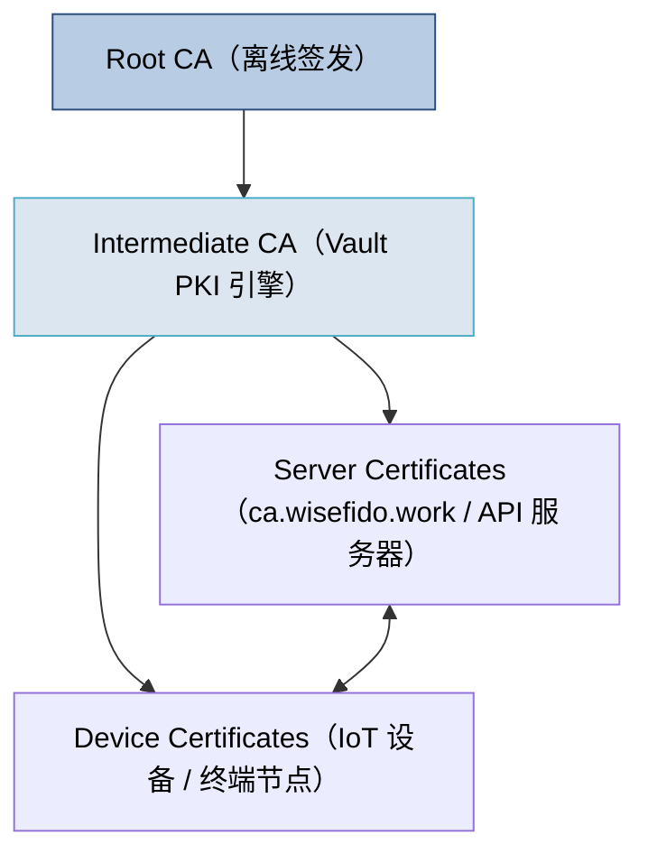
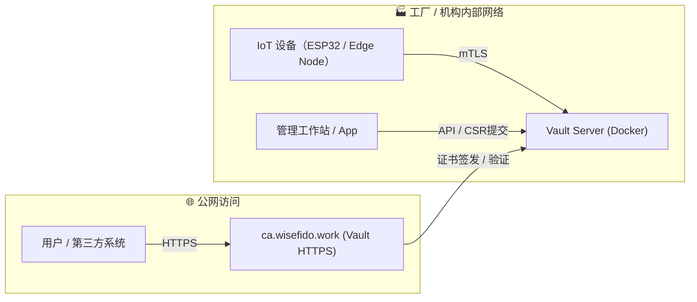
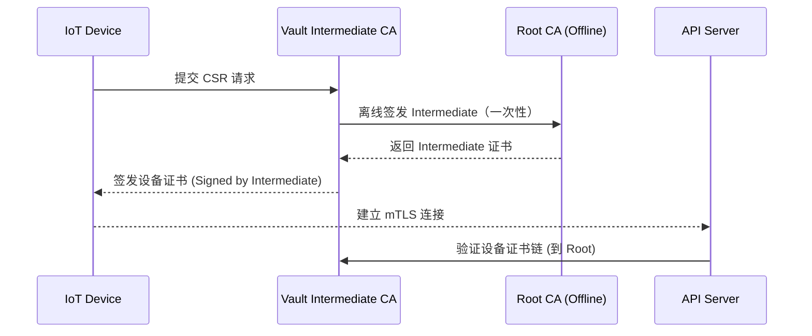

# 📘 卷 01：WiseFido_CA_总览与架构说明

**版本：v1.0**
**发布日期：2025-10-04**
**编制单位：WiseFido Engineering & Compliance Department**

---

## 🧭 1.1 文档定位与目标

本卷定义 **WiseFido CA 系统的整体架构与逻辑分层**，
用于明确 Root CA、Intermediate CA、Vault、IoT 设备、Nginx（如使用）及第三方系统之间的信任与交互关系。

目标：

- 描述完整信任链与证书层级；
- 展示系统拓扑结构；
- 确认各模块职责与运行环境；
- 明确 CA 层级间数据流与密钥安全边界。

---

## 🧱 1.2 WiseFido CA 架构概述

WiseFido 自建 CA 系统以 **HashiCorp Vault PKI 引擎** 为核心，通过两级证书体系实现从 Root CA 到 IoT 设备证书的签发与验证：

- **Root CA（离线）**：系统最高信任锚，仅用于签发 Intermediate CA；
- **Intermediate CA（在线）**：运行于 Vault，负责实际设备与服务器证书签发；
- **Vault Server**：托管 Intermediate CA 私钥，提供 HTTPS 接口；
- **IoT 设备**：嵌入 Root CA 证书，用于验证服务器证书与双向 TLS；
- **运维与管理接口**：通过 Docker Compose 部署、Web UI 或 CLI 操作。

---

## 🧩 1.3 架构关系图

### 系统层级关系（信任链）

系统部署拓扑图

---

## 🧩 1.4 系统模块职责表

| 模块编号 | 模块名称                | 功能描述                              | 运行环境                        |
| ---- | ------------------- | --------------------------------- | --------------------------- |
| M01  | Root CA             | 离线签发 Intermediate CA；最高信任锚；长期保存私钥 | 离线环境（冷存储 / 外部U盘）            |
| M02  | Intermediate CA     | 由 Root 签发，在 Vault 中运行；签发设备与服务器证书  | Ubuntu 24.04 + Vault Docker |
| M03  | Vault Server        | 提供 CA 管理接口、PKI 签发、审计与CRL分发        | 容器化部署，域名：`ca.wisefido.work` |
| M04  | IoT Device          | 设备端身份认证与数据加密通信；内置 Root CA         | ESP32 或同类 MCU               |
| M05  | Registration App    | 设备初始化、CSR上传、签发触发、证书注入             | Android / Web App           |
| M06  | Nginx Proxy（可选）     | 用于反代 HTTPS、负载均衡及统一域名访问            | 公网层，可选                      |
| M07  | External API System | 需通过 HTTPS/mTLS 与 CA 系统交互的外部系统     | 云或机构系统                      |

---

## 🔐 1.5 信任链与证书验证流程

说明：

Root CA 仅离线签发 Intermediate，一般不直接联网；

Intermediate 在 Vault 内运行，由 Vault 自动管理；

IoT 设备与服务器通过 Root 信任链相互验证；

若 Intermediate 私钥泄露，仅需 Root 重新签发新的 Intermediate。

---

## ⚙️ 1.6 系统运行环境信息

| 配置项                | 值                                     |
| ------------------ | ------------------------------------- |
| 操作系统               | Ubuntu Server 24.04 LTS (64-bit)      |
| 部署方式               | Docker Compose                        |
| Vault 版本           | 1.13.x                                |
| 网络接入               | 公网 HTTPS (`ca.wisefido.work:8200`)    |
| 通信端口               | TCP 8200（Vault 原生 TLS）                |
| 公网 IP              | 23.170.40.60                          |
| Root CA 位置         | 离线备份介质（U盘 / 加密盘）                      |
| Intermediate CA 存储 | Vault PKI 引擎内部                        |
| Vault 数据持久化        | Docker Volume 或本地挂载 `/opt/vault/data` |

---

## 📜 1.7 模块交互矩阵

| 来源 → 目标                     | Root CA | Intermediate (Vault) | IoT Device  | Server    | App            | External API |
| --------------------------- | ------- | -------------------- | ----------- | --------- | -------------- | ------------ |
| **Root CA**                 | —       | ✔ 签发 Intermediate    | ✘ 不直接交互     | ✘         | ✘              | ✘            |
| **Intermediate CA**         | ✘       | —                    | ✔ 签发设备证书    | ✔ 签发服务器证书 | ✔ 接收CSR        | ⚠ 仅信任交互      |
| **IoT Device**              | ✘       | ✔ 提交CSR              | —           | ✔ mTLS 握手 | ⚠ BLE/NFC 初次注册 | ✘            |
| **Server (API)**            | ✘       | ✔ 请求签发或验证            | ✔ mTLS 双向验证 | —         | ⚠ 日志上报         | ✔ HTTPS      |
| **App / Registration Tool** | ✘       | ✔ 提交CSR API          | ⚠ BLE 传输CSR | ✔ 触发签发    | —              | ✘            |
| **External API**            | ✘       | ⚠ 查询接口               | ✘           | ✔ HTTPS   | ✘              | —            |

---

## 🧠 1.8 架构设计关键原则

1. 离线 Root 安全优先  
   Root 私钥永不在线，物理隔离存储。

2. Vault 负责动态签发与审计  
   Intermediate CA 托管于 Vault PKI，引擎记录签发日志，可溯源。

3. IoT 设备与服务器完全基于证书验证  
   不依赖用户名密码，使用 mTLS 验证身份。

4. 模块化部署  
   支持单机或分布式扩展；Docker Compose 管理配置一致性。

5. 可合规迁移至云 CA（Google CAS）  
   Root 保持独立，Intermediate 可上云。

---

## ✅ 1.9 输出与交付物

| 编号  | 文件名                                        | 内容                 |
| --- | ------------------------------------------ | ------------------ |
| F01 | `01_WiseFido_CA_总览与架构说明.md`                | 当前文件               |
| F02 | `01_docs/images/architecture_topology.mmd` | 架构关系图原始 Mermaid 文件 |
| F03 | `01_docs/images/trust_chain.mmd`           | 信任链示意图             |
| F04 | `01_docs/tables/module_roles.csv`          | 模块职责表数据            |
| F05 | `01_docs/outputs/architecture_diagram.pdf` | 高保真 PDF 结构图（导出用）   |

---

编制人： WiseFido 系统架构组  
审核人： Chief Security Officer  
批准人： WiseFido Engineering Director  
发布日期： 2025-10-04
