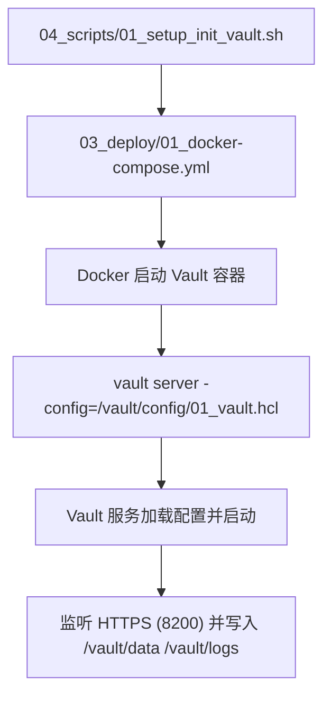
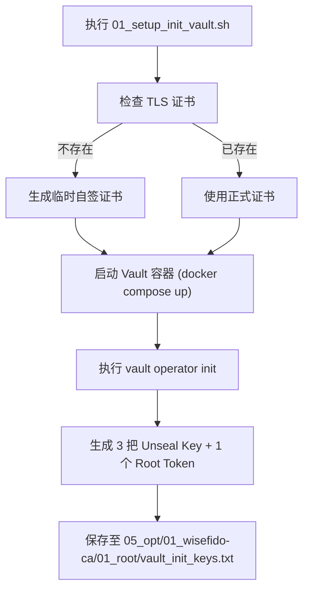
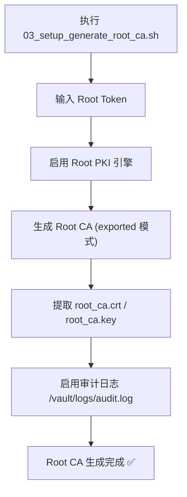

## 🧭 2.0 脚本总览与执行顺序（权威版）

| 编号 | 文件名 | 所属阶段 | 描述 | 入口命令 |
|---|---|---|---|---|
| 01 | `01_setup_init_vault.sh` | 部署 | 启动容器并初始化 Vault | `sudo bash 04_scripts/01_setup_init_vault.sh` |
| 02 | `02_setup_unseal_vault.sh` | 部署 | 使用 2 把 Unseal Key 解封 | `sudo bash 04_scripts/02_setup_unseal_vault.sh` |
| 03 | `03_setup_generate_root_ca.sh` | 部署 | 生成 Root CA 并启用审计 | `sudo bash 04_scripts/03_setup_generate_root_ca.sh` |
| 04 | `04_setup_create_intermediate_ca.sh` | 配置 | 创建/导入 Intermediate，配置 URLs | `sudo bash 04_scripts/04_setup_create_intermediate_ca.sh` |
| 05 | `05_setup_configure_https.sh` | 配置 | 使用 Intermediate 签发正式 HTTPS 并替换 | `sudo bash 04_scripts/05_setup_configure_https.sh` |
| 06 | `06_setup_test_and_validate.sh` | 验证 | 自检（证书链、TLS、审计、API健康） | `sudo bash 04_scripts/06_setup_test_and_validate.sh` |

# ⚙️ 卷 02：WiseFido_CA_部署与配置手册  
**版本：v1.0**  
**发布日期：2025-10-04**  
**编制单位：WiseFido Engineering & Infrastructure Division**

---

## 🧭 2.1 文件目的

本手册详细说明 **WiseFido CA 系统的部署与配置过程**，  
指导工程师在 Ubuntu Server 24.04 环境中，通过 Docker Compose 快速搭建 Vault CA 服务器。  

部署目标：
- 在服务器上启动 Vault PKI 服务；
- 生成 Root / Intermediate CA；
- 开启 HTTPS（Vault 原生 TLS）；
- 准备 IoT 设备证书签发接口；
- 验证部署结果可通过浏览器与 CLI 正常访问。  

---

## 🧱 2.2 部署环境说明

| 项目 | 参数 |
|---|---|
| 操作系统 | Ubuntu Server 24.04 LTS (64-bit) |
| 公网 IP | 23.170.40.60 |
| 域名 | `ca.wisefido.work` |
| 部署方式 | Docker Compose |
| Vault 版本 | 1.13.x (HashiCorp 官方镜像) |
| Docker 版本 | 25.0+ |
| Docker Compose | v2.27+ |
| 运行用户 | root / sudo 权限账户 |
| 证书目录 | `/opt/wisefido-ca/` |
| 数据卷挂载 | `../02_config` `./vault/data` `./vault/logs` |

---
## 📘 第 2.3 节 · Docker Compose 与 Vault 配置统一说明（v2.0）

本节描述 Vault 容器部署配置 (03_deploy/01_docker-compose.yml)
与 Vault 服务运行配置 (02_config/01_vault.hcl) 的统一规范。

目标：确保 Docker 层与 Vault 层配置路径、TLS 证书、数据挂载完全一致，避免多层路径混乱
---
### 🧭 2.3.1 目录层级关系（最终结构）
```bash
00_WiseFido_CA_Project/
├── 02_config/
│   ├── 01_vault.hcl          ← Vault 主配置文件（容器内 /vault/config/01_vault.hcl）
│   ├── vault_cert.pem        ← Vault HTTPS 证书（脚本 05 生成）
│   ├── vault_key.pem         ← Vault HTTPS 私钥
│
├── 03_deploy/
│   ├── 01_docker-compose.yml ← Vault 容器定义文件（部署层配置）
│   ├── vault/
│   │   ├── data/             ← Vault 数据持久化目录（PKI、secrets 等）
│   │   └── logs/             ← Vault 审计日志输出目录
│
└── 04_scripts/
    ├── 01_setup_init_vault.sh
    ├── ...
```
#### 💡 配置职责分层

* 02_config：静态配置（Vault HCL、TLS 证书）

* 03_deploy：运行部署（Compose 文件 + 数据/日志卷）

*04_scripts：自动化脚本操作容器

* 05_opt：CA 文件产出结果（Root / Intermediate / Issued）

### 🧱 2.3.2 Vault Compose 文件定义（部署层）

📄 文件路径：03_deploy/01_docker-compose.yml
```yaml
version: "3.8"

services:
  vault:
    image: vault:1.13.2
    container_name: wisefido-vault
    restart: always
    ports:
      - "8200:8200"
    cap_add:
      - IPC_LOCK

    # 🧩 目录挂载：配置、数据、日志
    volumes:
      - ../02_config:/vault/config
      - ./vault/data:/vault/data
      - ./vault/logs:/vault/logs

    environment:
      - VAULT_ADDR=https://ca.wisefido.work:8200
      - VAULT_API_ADDR=https://ca.wisefido.work:8200

    # 🔧 启动命令：加载容器内的 /vault/config/01_vault.hcl
    command: vault server -config=/vault/config/01_vault.hcl
```
#### 📘 说明：

* ../02_config → 容器 /vault/config

* ./vault/data → 容器 /vault/data

* ./vault/logs → 容器 /vault/logs

* vault server -config=/vault/config/01_vault.hcl 为 Vault 启动命令，直接引用同级的 HCL 配置文件。
---
### ⚙️ 2.3.3 Vault 主配置文件（服务层）

📄 文件路径：02_config/01_vault.hcl
```hcl
# =============================
# WiseFido Vault 主配置文件 (v2.0)
# =============================

ui = true
log_level = "info"

# 🔐 HTTPS 监听配置
listener "tcp" {
  address       = "0.0.0.0:8200"
  tls_cert_file = "/vault/config/vault_cert.pem"
  tls_key_file  = "/vault/config/vault_key.pem"
}

# 💾 存储引擎（文件型）
storage "file" {
  path = "/vault/data"
}

# 🌐 API 地址配置（与 Compose 环境变量一致）
api_addr = "https://ca.wisefido.work:8200"
cluster_addr = "https://ca.wisefido.work:8201"
```
---
### 🧩 2.3.4 Compose 与 HCL 的映射关系
| 项目     | Compose 定义                                        | Vault HCL 定义                                                     | 容器内路径                          |
| ------ | ------------------------------------------------- | ---------------------------------------------------------------- | ------------------------------ |
| 配置文件挂载 | `../02_config:/vault/config`                      | `-config=/vault/config/01_vault.hcl`                             | `/vault/config/01_vault.hcl`   |
| TLS 证书 | `../02_config/vault_cert.pem`                     | `tls_cert_file=/vault/config/vault_cert.pem`                     | `/vault/config/vault_cert.pem` |
| 数据存储   | `./vault/data:/vault/data`                        | `storage "file" { path="/vault/data" }`                          | `/vault/data`                  |
| 审计日志   | `./vault/logs:/vault/logs`                        | CLI 启用 `vault audit enable file file_path=/vault/logs/audit.log` | `/vault/logs`                  |
| 启动命令   | `vault server -config=/vault/config/01_vault.hcl` | —                                                                | —                              |
✅ Compose 控制容器“怎么跑”；
✅ Vault HCL 控制 Vault “怎么工作”。
---
### 🧭 2.3.5 启动流程图

---

### ✅ 2.3.6 章节小结
| 层级      | 文件                                  | 职责                                | 内容类型        |
| ------- | ----------------------------------- | --------------------------------- | ----------- |
| **部署层** | `03_deploy/01_docker-compose.yml`   | 定义 Vault 容器的启动方式与挂载路径             | Docker YAML |
| **服务层** | `02_config/01_vault.hcl`            | 定义 Vault 自身监听、TLS、存储等行为           | HCL 配置      |
| **执行层** | `04_scripts/01_setup_init_vault.sh` | 自动执行 Compose 启动与初始化流程             | Bash 脚本     |
| **数据层** | `03_deploy/vault/{data,logs}`       | Vault 运行态数据与日志                    | 文件系统        |
| **成果层** | `05_opt/01_wisefido-ca/`            | 存放 Root、Intermediate、Issued CA 文件 | 证书成果        |

---
**🔹 一句话总结：**
* 01_docker-compose.yml 负责“让 Vault 跑起来”；
* 01_vault.hcl 负责“Vault 跑起来后要怎么工作”。


---
## 📘 第 2.4 节 · Vault 初始化与 Root CA 配置流程（v2.0）

**本节描述 WiseFido Vault 从容器启动到Root CA 生成的完整过程。**
**涉及的核心脚本包括：**
| 序号 | 脚本文件                           | 功能摘要                         |
| -- | ------------------------------ | ---------------------------- |
| 01 | `01_setup_init_vault.sh`       | 初始化 Vault 环境与目录结构            |
| 02 | `02_setup_unseal_vault.sh`     | 输入密钥对 Vault 进行解封             |
| 03 | `03_setup_generate_root_ca.sh` | 启用 Root PKI 引擎并生成 Root CA 证书 |
| —  | —                              | 审计日志系统自动启用                   |

---
## 📘 第 2.4 节 · Vault 初始化与 Root CA 配置流程（v2.0）

本节描述 WiseFido Vault 从**容器启动**到**Root CA 生成**的完整过程。  
涉及的核心脚本包括：

| 序号 | 脚本文件 | 功能摘要 |
|------|------------|------------|
| 01 | `01_setup_init_vault.sh` | 初始化 Vault 环境与目录结构 |
| 02 | `02_setup_unseal_vault.sh` | 输入密钥对 Vault 进行解封 |
| 03 | `03_setup_generate_root_ca.sh` | 启用 Root PKI 引擎并生成 Root CA 证书 |
| — | — | 审计日志系统自动启用 |

---

### 🧭 2.4.1 初始化阶段（脚本 01）

📄 文件路径：`04_scripts/01_setup_init_vault.sh`

#### ⚙️ 核心逻辑

```bash
#!/bin/bash
set -euo pipefail
PROJECT_ROOT="/opt/00_WiseFido_CA_Project"

echo "🔹 准备目录..."
mkdir -p "${PROJECT_ROOT}/05_opt/01_wisefido-ca/01_root"
mkdir -p "${PROJECT_ROOT}/05_opt/01_wisefido-ca/02_intermediate"
mkdir -p "${PROJECT_ROOT}/05_opt/01_wisefido-ca/03_issued/01_devices"
mkdir -p "${PROJECT_ROOT}/05_opt/01_wisefido-ca/04_crl"

# 若无正式 TLS 证书，则生成临时自签证书
if [[ ! -f "${PROJECT_ROOT}/02_config/vault_cert.pem" || ! -f "${PROJECT_ROOT}/02_config/vault_key.pem" ]]; then
  echo "🔹 生成临时自签 TLS 证书..."
  openssl req -x509 -newkey rsa:2048 -nodes -days 365 \
    -subj "/CN=ca.wisefido.work/O=WiseFido Inc./C=US" \
    -keyout "${PROJECT_ROOT}/02_config/vault_key.pem" \
    -out "${PROJECT_ROOT}/02_config/vault_cert.pem"
fi

echo "🔹 启动 Vault 容器..."
cd "${PROJECT_ROOT}/03_deploy"
docker compose up -d

echo "🔹 初始化 Vault..."
docker exec -i wisefido-vault vault operator init -key-shares=3 -key-threshold=2 \
  > "${PROJECT_ROOT}/05_opt/01_wisefido-ca/01_root/vault_init_keys.txt"

echo "✅ 完成：vault_init_keys.txt 已生成，请立即离线备份！"
```

📊 执行流程图


---
📁 输出说明
| 文件路径                                                | 内容说明                                |
| --------------------------------------------------- | ----------------------------------- |
| `05_opt/01_wisefido-ca/01_root/vault_init_keys.txt` | 初始化生成的 3 把 Unseal Keys 与 Root Token |
| `02_config/vault_cert.pem`                          | 若无正式证书，则由脚本自动生成的临时 TLS 证书           |
| `02_config/vault_key.pem`                           | 临时 TLS 私钥文件                         |
| `03_deploy/vault/`                                  | 启动容器挂载的运行目录（数据与日志）                  |
---
⚠️ 安全注意事项

初始化后立即离线备份 vault_init_keys.txt；

不得将 Root Token 或 Unseal Keys 保留在公共服务器；

若使用临时自签证书，后续会在脚本 05 中替换为正式 HTTPS 证书。
---
✅ 执行结果

执行成功后可在终端看到：
```vbnet
Vault initialized with 3 key shares and a key threshold of 2.
Unseal Key 1: <KEY_1>
Unseal Key 2: <KEY_2>
Unseal Key 3: <KEY_3>
Initial Root Token: <ROOT_TOKEN>
```
输出文件：
```swift
/opt/00_WiseFido_CA_Project/05_opt/01_wisefido-ca/01_root/vault_init_keys.txt
```
Vault 容器状态检查：
```bash
docker ps | grep wisefido-vault
```
若状态为 Up 且端口 8200->8200/tcp 已绑定，则初始化完成。


###  🧩 2.4.2 解封阶段（脚本 02）

📄 文件路径：`04_scripts/02_setup_unseal_vault.sh`

#### ⚙️ 核心逻辑

```bash
#!/bin/bash
set -euo pipefail

read -p "输入第一个 Unseal Key: " key1
read -p "输入第二个 Unseal Key: " key2

docker exec -i wisefido-vault vault operator unseal "$key1"
docker exec -i wisefido-vault vault operator unseal "$key2"

docker exec -i wisefido-vault vault status
echo "✅ Vault 已成功解封。"
```
📊 解封流程图
```marmaid
graph TD
  A["执行 02_setup_unseal_vault.sh"] --> B["输入两把 Unseal Key"]
  B --> C["Vault 执行 unseal 操作"]
  C --> D["阈值达到 (threshold=2)"]
  D --> E["Vault 状态变为 unsealed ✅"]

```
---
📘 操作说明

脚本要求用户输入 2 把 Unseal Key，这些密钥来自文件
/opt/00_WiseFido_CA_Project/05_opt/01_wisefido-ca/01_root/vault_init_keys.txt。

只有当输入的密钥数量达到阈值 (threshold=2) 时，Vault 才会完全解封。

解封后，Vault 内部的加密存储层被激活，系统可接受 API 请求。

---
📁 输出说明
| 文件或命令                 | 内容             |
| --------------------- | -------------- |
| `vault_init_keys.txt` | 初始化阶段生成的密钥源文件  |
| `vault status`        | 解封后 Vault 状态报告 |
---
⚙️ 验证命令
```bash
docker exec -i wisefido-vault vault status
```
输出示例：
```pgsql
Key             Value
---             -----
Initialized     true
Sealed          false
Total Shares    3
Threshold       2
Version         1.13.2
Cluster Name    vault-cluster-xxxx
Cluster ID      12345678-ABCD-XXXX
HA Enabled      false
```
---
🧠 状态解释
| 参数                | 含义            | 目标状态     |
| ----------------- | ------------- | -------- |
| Initialized       | Vault 是否已初始化  | `true`   |
| Sealed            | Vault 是否被封印   | `false`  |
| Total Shares      | Unseal Key 总数 | `3`      |
| Threshold         | 解封阈值          | `2`      |
| Version           | 当前 Vault 版本   | `1.13.2` |
| Cluster Name / ID | 集群唯一标识        | 自动生成     |
---
⚠️ 常见问题与排查
| 问题                      | 可能原因                   | 解决方案                              |
| ----------------------- | ---------------------- | --------------------------------- |
| Vault 状态仍为 Sealed       | 只输入了一把 Key             | 必须达到阈值（2 把）                       |
| 输入 Key 后提示错误            | Unseal Key 输入错误或复制时有空格 | 重新从 `vault_init_keys.txt` 复制粘贴正确值 |
| 报错 “connection refused” | Vault 容器未完全启动          | 等待 5 秒后重试                         |
| 容器退出或报错                 | `01_vault.hcl` 路径或权限错误 | 检查 Compose 与配置路径一致性               |
| `permission denied`     | 当前用户无 Docker 权限        | 使用 `sudo` 重新执行脚本                  |

---
✅ 执行结果

解封成功后，Vault 状态应显示：
```ini
Initialized = true
Sealed = false

```
并可使用 Root Token 登录执行后续 Root CA 生成操作。
---
### 🧱 2.4.3 初始化与解封后的状态验证

在完成脚本 **`01_setup_init_vault.sh`** 与 **`02_setup_unseal_vault.sh`** 后，  
Vault 应处于“已初始化 + 已解封”的运行状态。  
此阶段的目标是通过命令行验证 Vault 的健康状态与基本配置信息。

---

#### ⚙️ 验证命令

执行以下命令以检查当前 Vault 状态：

```bash
docker exec -i wisefido-vault vault status
```
示例输出：

```pgsql
Key             Value
---             -----
Initialized     true
Sealed          false
Total Shares    3
Threshold       2
Version         1.13.2
Cluster Name    vault-cluster-xxxx
Cluster ID      12345678-ABCD-XXXX
HA Enabled      false
```
---
📘 状态参数说明
| 参数                    | 含义                    | 目标状态       |
| --------------------- | --------------------- | ---------- |
| **Initialized**       | 是否已初始化                | `true`     |
| **Sealed**            | 是否仍处于封印状态             | `false`    |
| **Total Shares**      | 初始化时生成的 Unseal Key 总数 | `3`        |
| **Threshold**         | 解封所需密钥数量阈值            | `2`        |
| **Version**           | 当前 Vault 服务版本         | `1.13.2`   |
| **Cluster Name / ID** | Vault 集群唯一标识符         | 自动生成       |
| **HA Enabled**        | 是否启用高可用模式             | 默认 `false` |
---
🧩 Web UI 访问验证

若 Vault 解封成功且 HTTPS 配置正常，可在浏览器访问：
```arduino
https://ca.wisefido.work:8200
```
浏览器应能显示 Vault 登录界面（可能提示自签证书不受信任）。
输入 Root Token 即可进入系统首页。
---
🧠 补充检查命令

1️⃣ 查看 Vault 运行日志
```bash
docker logs --tail 10 wisefido-vault

```
2️⃣ 验证容器运行状态：
2️⃣ 验证容器运行状态：
```bash
docker ps | grep wisefido-vault
```
输出示例：
```nginx
CONTAINER ID   IMAGE          COMMAND                  STATUS          PORTS
ab12cd34ef56   vault:1.13.2   "vault server -conf…"    Up 2 minutes    0.0.0.0:8200->8200/tcp
```
3️⃣ 通过 API 健康检查：
```bash
curl -sk https://ca.wisefido.work:8200/v1/sys/health | jq .
```
预期输出：
```json
{
  "initialized": true,
  "sealed": false,
  "standby": false,
  "version": "1.13.2"
}
```
---
✅ 验证目标总结
| 验证项             | 目标值                | 说明             |
| --------------- | ------------------ | -------------- |
| Vault 初始化状态     | Initialized = true | Vault 已完成首次初始化 |
| Vault 封印状态      | Sealed = false     | Vault 已解封      |
| 容器端口            | 8200 开放            | 可通过 HTTPS 访问   |
| Root Token 可用   | 可登录 UI 或 CLI       | 用于后续 PKI 配置    |
| Unseal Keys 已备份 | 已离线保存              | 防止丢失或泄漏        |
---
🎯 阶段目标：

Vault 已处于“运行 + 解封”状态；

可正常响应 API 请求与 Web UI 登录；

环境已准备好进入 Root CA 生成阶段（脚本 03）。
---
### ⚠️ 2.4.4 常见问题与排查

在 Vault 初始化与解封过程中，可能会遇到一些常见问题。  
本小节列出问题原因、错误表现及对应解决方案，  
以便在部署调试阶段快速定位。

---

#### 🧩 常见问题表

| 序号 | 问题描述 | 可能原因 | 解决方案 |
|------|------------|------------|------------|
| 1 | **容器启动后立即退出** | `01_vault.hcl` 路径错误或证书缺失 | 检查 Compose 文件挂载路径是否正确，确保 `/vault/config/01_vault.hcl` 存在 |
| 2 | **执行 `vault operator init` 报错 “connection refused”** | 容器启动未完全完成 | 等待 5–10 秒后重新执行脚本 |
| 3 | **执行 `vault operator init` 时长时间无响应** | 容器内网络问题或 Docker DNS 解析延迟 | 重启 Docker 服务后重试：`sudo systemctl restart docker` |
| 4 | **解封无效（Vault 状态仍为 Sealed）** | 只输入了一把 Unseal Key | 需要输入至少 2 把不同的密钥达到阈值（threshold=2） |
| 5 | **输入 Key 报错或拒绝接受** | 密钥复制粘贴时包含多余空格或换行 | 确保密钥完整，建议从 `vault_init_keys.txt` 直接复制 |
| 6 | **Vault 日志显示权限拒绝（permission denied）** | 容器内 `/vault/data` 或 `/vault/logs` 权限不足 | 在宿主机执行 `sudo chmod -R 755 03_deploy/vault` |
| 7 | **浏览器访问 HTTPS 提示不受信任** | 使用的是临时自签 TLS 证书 | 后续执行脚本 `05_setup_configure_https.sh` 替换为正式证书 |
| 8 | **`vault operator unseal` 提示 “Vault is sealed but uninitialized”** | 初始化脚本未成功执行或容器被重建 | 重新执行脚本 01 并检查日志输出 |
| 9 | **Vault CLI 命令输出乱码或中文乱码** | Shell 环境未启用 UTF-8 | 执行 `export LANG=C.UTF-8` 后重试 |
| 10 | **重复执行初始化脚本后产生多个容器** | 未清理旧实例 | 执行 `docker compose down` 删除旧容器后重新初始化 |

---

#### 🧠 深度排查技巧

1️⃣ 查看容器实时日志：
```bash
docker logs -f wisefido-vault
```
2️⃣ 检查 Vault 配置文件是否挂载正确：
```bash
docker exec -it wisefido-vault ls /vault/config
```
3️⃣ 验证端口 8200 是否被占用：
```bash
sudo ss -ltnp | grep 8200
```
4️⃣ 检查 Docker Compose 文件语法：
```bash
cd /opt/00_WiseFido_CA_Project/03_deploy
docker compose config
```
5️⃣ 若容器多次重启，可强制清理：
```bash
docker stop wisefido-vault
docker rm wisefido-vault
docker compose up -d
```
---
📘 诊断建议

Vault 启动日志是最重要的排查依据。
每次运行脚本后，建议立即查看：
```bash
docker logs --tail 20 wisefido-vault
```
若使用宝塔 Docker 插件，请确保其 Compose 配置未修改默认路径。
在宝塔界面下重启容器后，配置挂载路径可能被重置，需要重新校验。

对于首次部署，建议启用调试模式：
```bash
export VAULT_LOG_LEVEL=debug
```
---
✅ 小节总结

Vault 初始化与解封阶段的常见错误主要集中在：

配置文件路径不匹配；

容器启动未完成；

TLS 证书缺失；

权限或挂载问题；

Key 输入错误。

按上述排查步骤，可快速恢复 Vault 至正常可用状态。
---
### 🧭 2.4.5 阶段总结

经过脚本 **`01_setup_init_vault.sh`** 与 **`02_setup_unseal_vault.sh`** 的执行，  
Vault 已完成从部署到解封的基础初始化流程。  
此阶段是整个 CA 系统的“安全根基”，确保 Vault 进入可操作状态。

---

#### 📋 阶段目标达成情况

| 阶段 | 操作内容 | 目标结果 | 实际输出 |
|------|-----------|-----------|-----------|
| **初始化 (Init)** | 创建目录结构、生成 Unseal Keys、Root Token | Vault 初始化完成 | `vault_init_keys.txt` |
| **解封 (Unseal)** | 输入 2 把密钥解封 Vault | Vault 状态变为 Unsealed | `vault status` 显示 `Sealed=false` |
| **验证 (Verify)** | 检查 Vault 状态、访问 Web UI | Vault 可响应 HTTPS 与 API 请求 | Web UI 正常访问 |
| **安全 (Security)** | 离线备份密钥与 Root Token | 关键凭据已脱机保存 | ✅ 完成 |

---

#### 🧩 环境状态汇总

| 验证项 | 目标值 | 说明 |
|--------|---------|------|
| Vault 容器运行状态 | `Up` | 容器已启动且端口 8200 监听中 |
| Vault 初始化状态 | `Initialized = true` | 已完成初次初始化 |
| Vault 解封状态 | `Sealed = false` | Vault 已可用 |
| Root Token | 已获取 | 可用于登录 Vault 或 API 调用 |
| Unseal Keys | 已备份 | 保存在 `vault_init_keys.txt` |
| HTTPS 服务 | 已启用 | 默认监听 `https://ca.wisefido.work:8200` |
| 临时证书 | 已创建 | 待后续替换为正式证书 |
| 数据卷 | `/vault/data` | 数据持久化目录 |
| 日志卷 | `/vault/logs` | 审计日志存储路径 |

---

#### 🧠 阶段成果说明

- Vault 服务已完全可用，具备以下条件：
  1. 监听端口 `8200` 已激活；
  2. 内部存储目录 `/vault/data` 可读写；
  3. 具有 Root Token 可执行后续配置；
  4. 临时 TLS 证书正常提供 HTTPS 通道；
  5. CLI 与 Web UI 均可访问；
  6. 审计日志系统将在下一步自动启用。

---

#### ⚙️ 下一步操作计划

| 步骤 | 对应脚本 | 功能说明 |
|------|-----------|-----------|
| 1️⃣ | `03_setup_generate_root_ca.sh` | 启用 Root PKI 引擎，生成 Root CA |
| 2️⃣ | `04_setup_create_intermediate_ca.sh` | 创建中级 CA（Intermediate CA） |
| 3️⃣ | `05_setup_configure_https.sh` | 签发并配置 Vault HTTPS 正式证书 |
| 4️⃣ | `06_setup_test_and_validate.sh` | 验证完整 CA 信任链与配置正确性 |

---

#### ✅ 小节总结

> 至此，Vault 已处于“已初始化 + 已解封 + 可访问”状态。  
> 管理员应立即：
> - 安全备份 Root Token 与所有 Unseal Keys；  
> - 检查 Vault 端口与服务是否稳定；  
> - 准备进入下一阶段 **Root CA 生成与审计系统启用（脚本 03）**。  

---
### 🧭 2.4.6 生成 Root CA 与审计启用流程（脚本 03）

在 Vault 完成初始化与解封后，需通过脚本 **`03_setup_generate_root_ca.sh`**  
启用 Root PKI 引擎、生成 Root CA（根证书颁发机构），并开启 Vault 审计日志功能。  
该阶段是 CA 架构的核心环节，确立系统的信任根。

---

#### 📄 脚本路径

`04_scripts/03_setup_generate_root_ca.sh`

---

#### ⚙️ 核心逻辑

```bash
#!/bin/bash
set -euo pipefail
PROJECT_ROOT="/opt/00_WiseFido_CA_Project"
ROOT_DIR="${PROJECT_ROOT}/05_opt/01_wisefido-ca/01_root"

read -p "请输入 Vault Root Token: " token
export VAULT_ADDR="https://ca.wisefido.work:8200"
export VAULT_TOKEN="$token"
export VAULT_SKIP_VERIFY=true  # 临时自签证书可跳过校验

# 启用 Root PKI 引擎
docker exec -i wisefido-vault vault secrets enable -path=pki pki
docker exec -i wisefido-vault vault secrets tune -max-lease-ttl=87600h pki

# 生成 Root CA（导出模式）
docker exec -i wisefido-vault vault write -format=json pki/root/generate/exported \
  common_name="WiseFido Root CA" organization="WiseFido Inc." country="US" ttl=87600h \
  > "${ROOT_DIR}/root_ca_export.json"

# 导出证书与私钥
jq -r .data.certificate "${ROOT_DIR}/root_ca_export.json" > "${ROOT_DIR}/root_ca.crt"
jq -r .data.private_key "${ROOT_DIR}/root_ca_export.json" > "${ROOT_DIR}/root_ca.key"

# 启用审计日志
docker exec -i wisefido-vault sh -lc 'vault audit enable file file_path=/vault/logs/audit.log'

echo "✅ Root CA 生成完成：${ROOT_DIR}/root_ca.crt"
echo "⚠️ 请立即离线备份 root_ca.key，并删除服务器明文副本！"
```
---
📊 执行流程图

---
📁 输出文件与目录结构
| 文件路径                                                | 文件名          | 内容说明               |
| --------------------------------------------------- | ------------ | ------------------ |
| `05_opt/01_wisefido-ca/01_root/root_ca.crt`         | Root CA 公钥证书 | 系统信任锚文件            |
| `05_opt/01_wisefido-ca/01_root/root_ca.key`         | Root CA 私钥   | 需离线保存，生成后立即转移      |
| `05_opt/01_wisefido-ca/01_root/root_ca_export.json` | 导出 JSON 文件   | 含 Root CA PEM 编码数据 |
| `03_deploy/vault/logs/audit.log`                    | 审计日志         | 记录 Vault 操作及签发行为   |
---
🔐 安全与合规要求
| 项目             | 要求     | 说明                                     |
| -------------- | ------ | -------------------------------------- |
| **Root 私钥**    | 必须离线保存 | 严禁留存在服务器上                              |
| **审计日志**       | 自动启用   | Vault 所有操作记录写入 `/vault/logs/audit.log` |
| **Root Token** | 临时使用   | 仅用于执行此脚本的操作                            |
| **证书有效期**      | 10 年   | 由参数 `ttl=87600h` 指定                    |

> - ⚠️ 特别提示：
> -  Root CA 私钥是整个 CA 系统的核心安全资产，
> -  仅用于签发中级 CA，不得直接参与任何在线签发操作。
---
🧮 验证与检查

1️⃣ 检查 Root CA 文件是否生成：
```bash
ls -l /opt/00_WiseFido_CA_Project/05_opt/01_wisefido-ca/01_root/root_ca.*
```
2️⃣ 查看证书内容：
```bash
openssl x509 -in /opt/00_WiseFido_CA_Project/05_opt/01_wisefido-ca/01_root/root_ca.crt -text -noout | grep "Subject:"
```
3️⃣ 验证审计日志是否启用：
```bash
docker exec -i wisefido-vault vault audit list
```
预期输出：
```qgsql
Path      Type    Description
----      ----    -----------
file/     file    File audit device at /vault/logs/audit.log
```
---
📘 执行结果与后续步骤
| 阶段         | 操作                         | 结果        |
| ---------- | -------------------------- | --------- |
| 启用 PKI 引擎  | Vault 启动 `/pki` 路径         | 成功        |
| 生成 Root CA | WiseFido Root CA 创建完成      | ✅         |
| 启用审计日志     | `/vault/logs/audit.log` 激活 | ✅         |
| 输出文件       | root_ca.crt / root_ca.key  | 已导出       |
| 下一步        | 生成中级 CA（Intermediate）      | 准备进入脚本 04 |
---

✅ 小节总结

>**至此，Vault 已完成以下操作：**

> - Root PKI 引擎启用；

> -Root CA（根证书）生成；

> - Root 私钥安全导出；

> - 审计日志系统成功启用。

> **Vault 已具备完整的 Root 信任链基础，**
>**下一步将执行 脚本 04 与 05，生成中级 CA 并配置 HTTPS 证书。**

--


---

## 🔐 2.5 Intermediate CA 生成与导入

Intermediate CA 负责签发 IoT 设备与服务器证书。  
Root CA 仅离线使用，一次性签发 Intermediate 证书。

### 🧩 脚本 04：创建 Intermediate CA  
文件名：`04_scripts/04_setup_create_intermediate_ca.sh`

```bash
#!/bin/bash
set -euo pipefail
PROJECT_ROOT="/opt/00_WiseFido_CA_Project"
INT_DIR="${PROJECT_ROOT}/05_opt/01_wisefido-ca/02_intermediate"

read -p "请输入 Vault Root Token: " token
export VAULT_ADDR="https://ca.wisefido.work:8200"
export VAULT_TOKEN="$token"
export VAULT_SKIP_VERIFY=true

# 启用 Intermediate PKI 引擎
docker exec -i wisefido-vault vault secrets enable -path=pki_int pki
docker exec -i wisefido-vault vault secrets tune -max-lease-ttl=43800h pki_int

# 生成 Intermediate CSR
docker exec -i wisefido-vault vault write -field=csr pki_int/intermediate/generate/internal \
  common_name="WiseFido Intermediate CA" organization="WiseFido Inc." country="US" ttl=43800h \
  > "${INT_DIR}/intermediate.csr"

echo "✅ Intermediate CSR 生成：${INT_DIR}/intermediate.csr"
echo "🔹 请使用 Root CA 离线签署此 CSR..."


```

---
🧩 离线 Root 签署 Intermediate

在离线 Root 环境中（例如安全工作站）执行：

```bash
cd /opt/00_WiseFido_CA_Project/05_opt/01_wisefido-ca
openssl x509 -req -in 02_intermediate/intermediate.csr \
  -CA 01_root/root_ca.crt -CAkey 01_root/root_ca.key -CAcreateserial \
  -out 02_intermediate/intermediate.crt -days 1825 \
  -extensions v3_ca -extfile <(printf "[v3_ca]\nbasicConstraints=CA:TRUE,pathlen:0")
```
然后将生成的 intermediate.crt 导回服务器，执行：
```bash

docker cp /opt/00_WiseFido_CA_Project/05_opt/01_wisefido-ca/02_intermediate/intermediate.crt wisefido-vault:/vault/
docker exec -i wisefido-vault vault write pki_int/intermediate/set-signed certificate=@/vault/intermediate.crt
```
配置证书 URL：
```bash
docker exec -i wisefido-vault vault write pki_int/config/urls \
  issuing_certificates="https://ca.wisefido.work:8200/v1/pki_int/ca" \
  crl_distribution_points="https://ca.wisefido.work:8200/v1/pki_int/crl"
```
✅ 完成后 Vault 已具备签发能力。
所有签发的证书都由 Intermediate CA 私钥签名，并最终由 Root CA 链接信任

---

⚙️ 2.6 Vault HTTPS 正式证书配置

Vault 初次启动使用了临时自签证书。
在生成 Intermediate 后，我们可以签发正式的服务器证书供 Vault HTTPS 使用。

🧩 脚本 05：为 Vault 签发正式证书

文件名：04_scripts/05_setup_configure_https.sh

```bash
#!/bin/bash
set -euo pipefail
PROJECT_ROOT="/opt/00_WiseFido_CA_Project"
CONF_DIR="${PROJECT_ROOT}/02_config"

read -p "请输入 Vault Root Token: " token
export VAULT_ADDR="https://ca.wisefido.work:8200"
export VAULT_TOKEN="$token"
export VAULT_SKIP_VERIFY=true

# 创建角色（允许签发服务器证书）
docker exec -i wisefido-vault vault write pki_int/roles/vault-server-role \
  allowed_domains="wisefido.work" allow_subdomains=true max_ttl="8760h"

# 签发服务器证书
docker exec -i wisefido-vault vault write -format=json pki_int/issue/vault-server-role \
  common_name="ca.wisefido.work" ttl="8760h" > "${CONF_DIR}/vault_server_cert.json"

jq -r .data.certificate "${CONF_DIR}/vault_server_cert.json" > "${CONF_DIR}/vault_cert.pem"
jq -r .data.private_key "${CONF_DIR}/vault_server_cert.json" > "${CONF_DIR}/vault_key.pem"

echo "✅ 新 HTTPS 证书生成完成，路径：${CONF_DIR}/vault_cert.pem"
echo "🔄 重启 Vault 容器以加载新证书..."
cd "${PROJECT_ROOT}/03_deploy"
docker compose restart vault
```
- 验证 Vault UI：在浏览器中访问https://ca.wisefido.work:8200
- 应能正确显示 HTTPS 并由 WiseFido Intermediate CA 签发。

---

🧩 2.7 签发测试证书（服务器与 IoT 设备）
示例：签发服务器证书
```bash
docker exec -i wisefido-vault vault write -format=json pki_int/issue/vault-server-role \
  common_name="api.wisefido.work" ttl="4380h" > /opt/00_WiseFido_CA_Project/05_opt/01_wisefido-ca/03_issued/server_api.json

jq -r .data.certificate /opt/00_WiseFido_CA_Project/05_opt/01_wisefido-ca/03_issued/server_api.json > /opt/00_WiseFido_CA_Project/05_opt/01_wisefido-ca/03_issued/server_api.crt
jq -r .data.private_key /opt/00_WiseFido_CA_Project/05_opt/01_wisefido-ca/03_issued/server_api.json > /opt/00_WiseFido_CA_Project/05_opt/01_wisefido-ca/03_issued/server_api.key
```
示例：签发 IoT 设备证书
```bash
docker exec -i wisefido-vault vault write -format=json pki_int/issue/device-role \
  common_name="iot-device-001.wisefido.work" ttl="8760h" > /opt/00_WiseFido_CA_Project/05_opt/01_wisefido-ca/03_issued/01_devices/device_001.json

jq -r .data.certificate /opt/00_WiseFido_CA_Project/05_opt/01_wisefido-ca/03_issued/01_devices/device_001.json > /opt/00_WiseFido_CA_Project/05_opt/01_wisefido-ca/03_issued/01_devices/device_001.crt
jq -r .data.private_key /opt/00_WiseFido_CA_Project/05_opt/01_wisefido-ca/03_issued/01_devices/device_001.json > /opt/00_WiseFido_CA_Project/05_opt/01_wisefido-ca/03_issued/01_devices/device_001.key
```
IoT 设备可将 device_001.crt 与 Root CA 链写入安全芯片，完成出厂注册。

---

🧪 2.8 验证与测试
1️⃣ 验证证书链
```bash
openssl verify -CAfile /opt/00_WiseFido_CA_Project/05_opt/01_wisefido-ca/01_root/root_ca.crt \
  /opt/00_WiseFido_CA_Project/05_opt/01_wisefido-ca/02_intermediate/intermediate.crt
```
2️⃣ 验证 Vault HTTPS
```bash
curl -v --cacert /opt/00_WiseFido_CA_Project/05_opt/01_wisefido-ca/01_root/root_ca.crt https://ca.wisefido.work:8200/v1/sys/health
```
返回示例：

```arduine
HTTP/2 200
{
  "initialized": true,
  "sealed": false,
  "standby": false
}
```
3️⃣ 检查审计日志
```bash
docker exec -i wisefido-vault cat /vault/logs/audit.log | jq .
```
应包含签发操作记录。

---

🧯 2.9 常见问题与恢复流程

| 问题场景                                 | 可能原因          | 解决步骤                                                                                       |
| ------------------------------------ | ------------- | ------------------------------------------------------------------------------------------ |
| Vault 容器启动失败                         | TLS 文件缺失或权限错误 | 确认 `/opt/00_WiseFido_CA_Project/02_config/vault_cert.pem` 与 `vault_key.pem` 存在且权限为 644/600 |
| HTTPS 报错 "certificate verify failed" | 临时自签证书仍在使用    | 执行脚本 05 重新签发正式证书并 `docker compose restart`                                                 |
| `vault operator init` 已运行过           | 重复初始化         | 删除数据卷重新部署：`docker compose down -v`                                                         |
| Intermediate 导入报错                    | CSR 或证书路径错误   | 确认 `.csr`、`.crt` 文件均存在且 Vault 已解封                                                          |
| 浏览器无法访问 8200                         | 防火墙或安全组未放行    | 开放 TCP 8200 端口                                                                             |
| 审计日志空白                               | 未启用审计         | 运行：`vault audit enable file file_path=/vault/logs/audit.log`                               |

---

✅ 部署完成标志

| 项目              | 验证命令                                                        | 正常输出            |
| --------------- | ----------------------------------------------------------- | --------------- |
| Vault 状态        | `docker exec -it wisefido-vault vault status`               | `Sealed: false` |
| Root CA         | `ls 05_opt/01_wisefido-ca/01_root/root_ca.crt`              | 存在              |
| Intermediate CA | `ls 05_opt/01_wisefido-ca/02_intermediate/intermediate.crt` | 存在              |
| HTTPS 访问        | 浏览器打开 `https://ca.wisefido.work:8200`                       | 正常响应            |
| 审计日志            | `docker exec -it wisefido-vault cat /vault/logs/audit.log`  | 有签发记录           |

---
## 🧪 2.10 脚本06：测试与验证（完整实现）

**路径：** `04_scripts/06_setup_test_and_validate.sh`

```bash
#!/bin/bash
set -euo pipefail
PROJECT_ROOT="/opt/00_WiseFido_CA_Project"

echo "🔍 Vault 运行状态检查..."
docker exec -i wisefido-vault vault status || { echo "❌ Vault 未运行"; exit 1; }

echo "🔍 Root/Intermediate 文件检查..."
test -f "${PROJECT_ROOT}/05_opt/01_wisefido-ca/01_root/root_ca.crt" || { echo "❌ Root CA 缺失"; exit 1; }
test -f "${PROJECT_ROOT}/05_opt/01_wisefido-ca/02_intermediate/intermediate.crt" || { echo "❌ Intermediate 缺失"; exit 1; }

echo "🔍 测试 Vault HTTPS 接口..."
curl -sk --cacert "${PROJECT_ROOT}/05_opt/01_wisefido-ca/01_root/root_ca.crt" \
  https://ca.wisefido.work:8200/v1/sys/health | jq . > "${PROJECT_ROOT}/05_opt/test_vault_health.json"

echo "🔍 验证证书链..."
openssl verify -CAfile "${PROJECT_ROOT}/05_opt/01_wisefido-ca/01_root/root_ca.crt" \
  "${PROJECT_ROOT}/05_opt/01_wisefido-ca/02_intermediate/intermediate.crt"

echo "🔍 审计日志验证..."
docker exec -i wisefido-vault sh -lc 'test -f /vault/logs/audit.log && echo "✅ 审计日志已启用" || echo "⚠ 未启用审计"'

echo "🔍 测试设备证书签发接口可用性（仅检查角色列表）..."
curl -sk --header "X-Vault-Token: <root_token>" \
  https://ca.wisefido.work:8200/v1/pki_int/roles | jq . > "${PROJECT_ROOT}/05_opt/test_vault_roles.json"

echo "✅ 所有测试完成，结果已写入："
echo "   - ${PROJECT_ROOT}/05_opt/test_vault_health.json"
echo "   - ${PROJECT_ROOT}/05_opt/test_vault_roles.json"
```
---

✅ 版本信息：
WiseFido Vault Compose & HCL 配置标准版 v2.0
更新日期：2025-10-08
编制：WiseFido DevOps 团队
审阅：Chief Security Officer
批准：WiseFido Engineering Director
