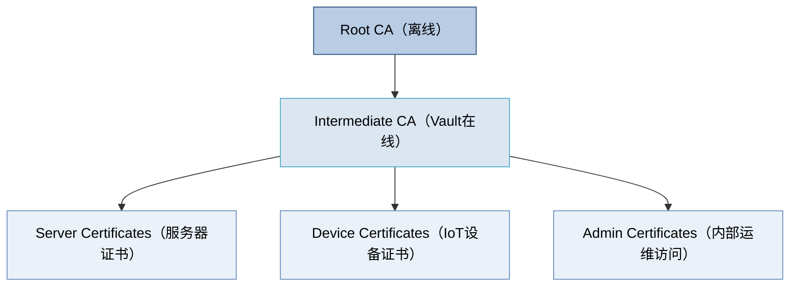

# 📜 卷 03：WiseFido_CA_证书体系与文件命名规范

---

## 🧭 3.1 文档目的

本文件定义 **WiseFido CA 系统中所有证书、密钥、请求文件与吊销列表的命名规则与文件结构**。通过统一命名规范，保证：

- 不同工程人员在不同阶段（开发、生产、维护）操作同一目录时无歧义；
- 自动化脚本可按规则查找文件；
- 合规审计可快速定位 Root、Intermediate、Issued、CRL 各层级数据。

---

## 🧱 3.2 证书体系层级

WiseFido CA 的证书体系遵循三层信任结构：



说明：

- Root CA：最高信任锚，只用于签发 Intermediate；
- Intermediate CA：在线签发实际使用的服务器与设备证书；
- End Entity（Server / Device / Admin）：由 Intermediate 签发并受 Root 信任；
- CRL：吊销列表，记录废弃或过期的证书。

---

🧩 3.3 目录结构总览（与《卷 00》保持一致）


📘 所有文件与目录均使用两位编号前缀，确保在系统中自然排序。

---

🧾 3.4 文件命名规范总表

| 文件类型                       | 命名规则                   | 示例                             | 说明                          |
| ------------------------------ | -------------------------- | -------------------------------- | ----------------------------- |
| **Root CA 证书**         | `root_ca.crt`            | `root_ca.crt`                  | Root CA 公钥证书（自签）      |
| **Root CA 私钥**         | `root_ca.key`            | `root_ca.key`                  | 离线保存，不上传服务器        |
| **Root CA 导出JSON**     | `root_ca_export.json`    | `root_ca_export.json`          | Vault 导出原始文件            |
| **Intermediate CA CSR**  | `intermediate.csr`       | `intermediate.csr`             | 由 Vault 生成的签名请求       |
| **Intermediate CA 证书** | `intermediate.crt`       | `intermediate.crt`             | Root 签发的 Intermediate 证书 |
| **Intermediate 链文件**  | `intermediate_chain.crt` | `intermediate_chain.crt`       | Intermediate + Root 组合      |
| **服务器证书**           | `server_<域名>.crt`      | `server_api.wisefido.work.crt` | 签发给服务器的证书            |
| **服务器私钥**           | `server_<域名>.key`      | `server_api.wisefido.work.key` | 服务器端 TLS 私钥             |
| **设备证书**             | `device_<序列号>.crt`    | `device_00001.crt`             | 签发给 IoT 设备               |
| **设备私钥**             | `device_<序列号>.key`    | `device_00001.key`             | IoT 设备私钥                  |
| **证书签发结果**         | `<实体名>.json`          | `server_api.json`              | Vault API 签发结果原始JSON    |
| **吊销列表**             | `crl_<日期>.pem`         | `crl_2025-10-04.pem`           | 吊销证书列表                  |
| **当前有效CRL**          | `crl_current.pem`        | `crl_current.pem`              | 当前生效版本                  |
| **上一次CRL**            | `crl_previous.pem`       | `crl_previous.pem`             | 前一版本                      |

---

🧱 3.5 命名规则约定（正则规范）

所有命名均符合以下正则：

```ruby
Root/Intermediate/Issued:
  ^[a-z0-9_.-]+(\.crt|\.key|\.csr|\.pem|\.json)$
设备证书：
  ^device_[0-9]{5}\.(crt|key|json)$
服务器证书：
  ^server_[a-z0-9.-]+\.(crt|key|json)$
CRL：
  ^crl_(current|previous|[0-9]{4}-[0-9]{2}-[0-9]{2})\.pem$

```

规则说明：

- 文件名全部小写；
- 日期统一格式 YYYY-MM-DD；
- 设备编号固定五位（00001～99999）；
- 禁止空格与大写字母；
- 所有文件扩展名必须为小写。

---

🧩 3.6 证书用途与扩展属性

| 层级            | Key Usage                                      | Extended Key Usage                | 注释                         |
| --------------- | ---------------------------------------------- | --------------------------------- | ---------------------------- |
| Root CA         | `Digital Signature, Key Cert Sign, CRL Sign` | —                                | Root 仅用于签发 Intermediate |
| Intermediate CA | `Digital Signature, Key Cert Sign, CRL Sign` | —                                | 在线签发服务器/设备          |
| Server Cert     | `Digital Signature, Key Encipherment`        | `TLS Web Server Authentication` | HTTPS/TLS 服务器证书         |
| Device Cert     | `Digital Signature`                          | `TLS Web Client Authentication` | IoT设备mTLS认证              |
| Admin Cert      | `Digital Signature, Key Encipherment`        | `TLS Client Auth, Code Signing` | 运维访问或代码签名           |
| CRL             | —                                             | —                                | 由 Intermediate 定期更新     |

---

🧰 3.7 证书有效期策略

| 层级            | 有效期 | 备注                   |
| --------------- | ------ | ---------------------- |
| Root CA         | 10 年  | 离线签发一次即可       |
| Intermediate CA | 5 年   | 到期前重新由 Root 签发 |
| Server 证书     | 1 年   | 每年自动续签           |
| IoT 设备证书    | 3 年   | 可 OTA 更新            |
| CRL             | 7 天   | 每周刷新               |

---

🧮 3.8 文件权限与访问控制

| 文件类型          | 所属用户              | 权限 | 存储位置                     | 建议               |
| ----------------- | --------------------- | ---- | ---------------------------- | ------------------ |
| Root CA 私钥      | `root`              | 600  | 离线介质                     | 离线保存，不上网   |
| Intermediate 私钥 | `vault` (容器内部)  | 600  | `/vault/data/`             | 仅 Vault 内访问    |
| 服务器证书与私钥  | `nginx` / `vault` | 640  | `/etc/ssl/wisefido/`       | 仅服务进程可读     |
| IoT 设备证书      | `firmware team`     | 640  | 安全芯片 / 烧录区            | 出厂预置，不可导出 |
| 吊销列表          | `vault`             | 644  | `/vault/data/pki_int/crl/` | 定期轮换           |

---

🧮 3.9 文件层级与编号映射表

| 层级                | 编号                 | 说明             |
| ------------------- | -------------------- | ---------------- |
| Root CA             | 01_root              | 离线签发源       |
| Intermediate CA     | 02_intermediate      | Vault在线CA      |
| Issued Certificates | 03_issued            | 设备与服务器证书 |
| Devices             | 03_issued/01_devices | IoT设备          |
| Servers             | 03_issued/02_servers | 应用服务器       |
| Admin               | 03_issued/03_admin   | 内部证书         |
| CRL                 | 04_crl               | 吊销列表         |

---

🧾 3.10 证书吊销与更新策略

1. 吊销操作命令：

```bash
docker exec -i wisefido-vault vault write pki_int/revoke serial_number=<序列号>
```

2. 生成新的 CRL：

```bash
docker exec -i wisefido-vault vault write pki_int/crl/rotate
```

3. 导出并更新：

```bash
docker exec -i wisefido-vault vault read -field=certificate pki_int/crl > /opt/00_WiseFido_CA_Project/05_opt/01_wisefido-ca/04_crl/crl_current.pem
```

---

✅ 3.11 版本控制与合规要求

* 所有 CA 文件目录纳入 Git 仓库 仅限结构与示例文件，实际证书文件不入库；
* Root 与 Intermediate 私钥不允许通过网络传输；
* 每次更新命名规则需提交变更评审；
* 每次证书重签发后更新此卷文档版本号。

---

编制人： WiseFido PKI 小组
审核人： Chief Security Officer
批准人： WiseFido Engineering Director
发布日期： 2025-10-04