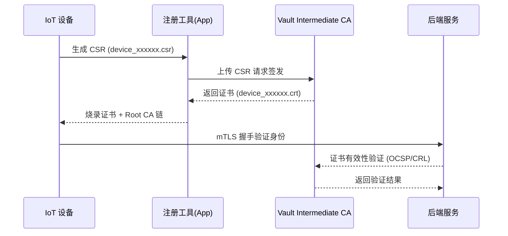
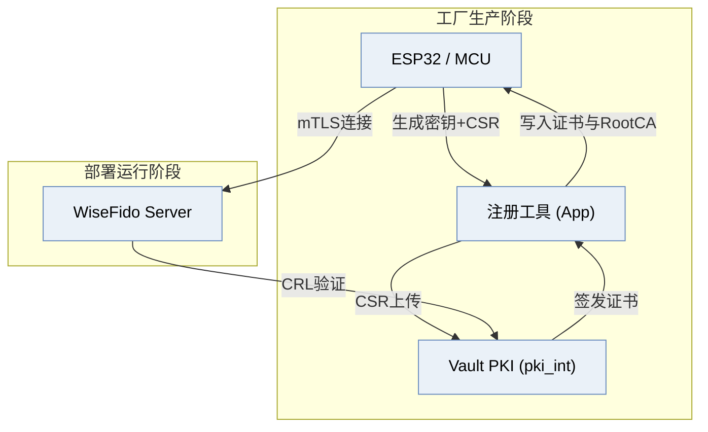

# 🔐 卷 04：WiseFido_IoT_设备注册与证书签发流程  
**版本：v1.0**  
**发布日期：2025-10-04**  
**编制单位：WiseFido Embedded Security Division**

---

## 🧭 4.1 文档目的

本文件用于指导 **IoT 设备（如 ESP32）** 在生产及部署阶段如何：
1. 生成并提交证书签名请求（CSR）；  
2. 通过 HashiCorp Vault Intermediate CA 签发设备证书；  
3. 将 Root CA 链嵌入设备固件；  
4. 完成双向 TLS 认证（mTLS）注册流程。

---

## 🧱 4.2 流程总览图（生命周期）


---
🧩 4.3 设备身份注册架构

---
⚙️ 4.4 设备侧密钥与 CSR 生成
📘 示例：ESP32 设备代码（C 语言）

文件：ESP32 上的 CSR 生成代码实现.docx（已在项目文件中）

核心逻辑（节选）：
```c
#include "mbedtls/pk.h"
#include "mbedtls/x509_csr.h"

mbedtls_pk_context key;
mbedtls_x509write_csr req;

mbedtls_pk_init(&key);
mbedtls_x509write_csr_init(&req);

mbedtls_pk_setup(&key, mbedtls_pk_info_from_type(MBEDTLS_PK_RSA));
mbedtls_rsa_gen_key(mbedtls_pk_rsa(key), mbedtls_ctr_drbg_random, &ctr_drbg, 2048, 65537);

mbedtls_x509write_csr_set_subject_name(&req, "CN=iot-device-00001,O=WiseFido Inc,C=US");
mbedtls_x509write_csr_set_key(&req, &key);
mbedtls_x509write_csr_set_md_alg(&req, MBEDTLS_MD_SHA256);

mbedtls_x509write_csr_pem(&req, csr_buf, sizeof(csr_buf), mbedtls_ctr_drbg_random, &ctr_drbg);
```
输出文件：
```bash
device_00001.key   # 设备私钥
device_00001.csr   # 设备证书请求
```
---
🧩 4.5 设备注册流程（注册 App 执行）

注册 App（或 Web 工具）与 Vault API 交互。
以下示例使用 curl 说明接口调用逻辑。
```bash
# 上传 CSR 并请求签发
curl --header "X-Vault-Token: <vault_token>" \
     --request POST \
     --data @device_00001.csr \
     https://ca.wisefido.work:8200/v1/pki_int/sign/device-role
```
Vault 返回 JSON：
```json
{
  "data": {
    "certificate": "-----BEGIN CERTIFICATE----- ...",
    "issuing_ca": "-----BEGIN CERTIFICATE----- ...",
    "ca_chain": ["...RootCA...", "...IntermediateCA..."],
    "private_key_type": "rsa"
  }
}
```
App 从响应中提取：

certificate → 写入 device_00001.crt

ca_chain → 嵌入 Root 与 Intermediate

将 device_00001.crt 和 Root 链写入 ESP32 Flash 安全区。

---
🔐 4.6 设备端 Root CA 链嵌入策略
| 层级              | 文件                  | 存放位置                       | 说明     |
| --------------- | ------------------- | -------------------------- | ------ |
| Root CA         | `root_ca.crt`       | Flash ROM（只读区）             | 出厂时内置  |
| Intermediate CA | `intermediate.crt`  | Flash ROM 或 OTA 区域         | 可随时更新  |
| Device Cert     | `device_xxxxxx.crt` | Flash RAM / Secure Storage | 唯一标识设备 |
| Device Key      | `device_xxxxxx.key` | Secure Element / OTP       | 永久性存储  |
建议：

* 若设备支持安全元件（ATECC608/SE050），可将私钥存入硬件安全模块；

* Root CA 固化在 ROM，不随 OTA 更新；

* Intermediate 与 Device 证书可 OTA 替换。


🧮 4.7 设备双向认证握手过程（mTLS）
```mermaid
sequenceDiagram
    participant Device as IoT Device
    participant Server as WiseFido Server
    participant Vault as CA 验证服务

    Device->>Server: ClientHello + 证书链
    Server->>Device: ServerHello + 服务器证书
    Device->>Server: 验证服务器证书链（Root→Intermediate）
    Server->>Vault: 检查 Device 证书状态（CRL/OCSP）
    Vault-->>Server: 验证通过
    Device<-->Server: mTLS 握手成功，建立加密信道
```
IoT 设备在 TLS 握手阶段使用证书链校验服务器身份，
服务器反向校验证书，确保每个设备都是经 Vault 签发的合法实体。

---

🧩 4.8 Vault 签发角色配置（后端操作）

由管理员在 Vault 配置 IoT 证书签发角色。
文件：04_scripts/07_setup_device_role.sh
```bash
#!/bin/bash
set -euo pipefail

export VAULT_ADDR="https://ca.wisefido.work:8200"
export VAULT_TOKEN="<root_token>"

docker exec -i wisefido-vault vault write pki_int/roles/device-role \
  allowed_domains="wisefido.work" \
  allow_subdomains=true \
  allow_any_name=true \
  key_type="rsa" key_bits=2048 \
  max_ttl="26280h"  # 3年
```
---
⚙️ 4.9 设备证书验证与吊销
1️⃣ 验证证书合法性
```bash
openssl verify -CAfile /opt/00_WiseFido_CA_Project/05_opt/01_wisefido-ca/01_root/root_ca.crt \
  -untrusted /opt/00_WiseFido_CA_Project/05_opt/01_wisefido-ca/02_intermediate/intermediate.crt \
  device_00001.crt
```
2️⃣ 吊销设备证书
```bahs
docker exec -i wisefido-vault vault write pki_int/revoke serial_number=<serial_number>
docker exec -i wisefido-vault vault write pki_int/crl/rotate
docker exec -i wisefido-vault vault read -field=certificate pki_int/crl > \
  /opt/00_WiseFido_CA_Project/05_opt/01_wisefido-ca/04_crl/crl_current.pem
```
3️⃣ 服务器同步更新 CRL
```bash
curl -o /etc/ssl/crl/crl_current.pem https://ca.wisefido.work:8200/v1/pki_int/crl
systemctl reload nginx
```

---
🧰 4.10 设备出厂流程摘要
| 阶段 | 操作           | 工具/模块           | 输出文件                                     |
| -- | ------------ | --------------- | ---------------------------------------- |
| 1  | 生成私钥+CSR     | ESP32 + MbedTLS | `device_xxxxxx.key`, `device_xxxxxx.csr` |
| 2  | 上传 CSR       | 注册 App          | Vault API 调用                             |
| 3  | 签发证书         | Vault           | `device_xxxxxx.crt`                      |
| 4  | 烧录证书与 Root 链 | 注册工具            | Flash ROM                                |
| 5  | 出厂测试         | QA 测试软件         | mTLS 连接确认                                |
| 6  | 入网注册         | 生产系统            | 设备序列号登记表                                 |

---
🧠 4.11 安全注意事项

✔ Root CA 不可更新，仅离线重签 Intermediate
✔ Intermediate 可 OTA 更新（带版本签名校验）
✔ 设备私钥永不出厂
✔ Vault 所有签发均记录审计日志
✔ 注册 App 通信仅限 HTTPS（mTLS）
✔ 签发 Token 权限受限，仅限设备注册角色

---
✅ 4.12 交付物清单
| 文件编号 | 文件名                                            | 内容           |
| ---- | ---------------------------------------------- | ------------ |
| F01  | `04_WiseFido_IoT_设备注册与证书签发流程.md`               | 当前文档         |
| F02  | `04_scripts/07_setup_device_role.sh`           | Vault 角色配置脚本 |
| F03  | `ESP32 上的 CSR 生成代码实现.docx`                     | 设备端 CSR 生成代码 |
| F04  | `05_opt/01_wisefido-ca/03_issued/01_devices/`  | 设备证书与密钥存储目录  |
| F05  | `05_opt/01_wisefido-ca/04_crl/crl_current.pem` | 吊销列表文件       |

---

编制人： WiseFido 嵌入式安全团队
审核人： Chief Security Officer
批准人： WiseFido Engineering Director
发布日期： 2025-10-04

