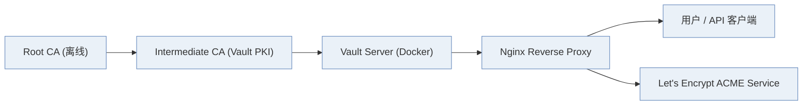
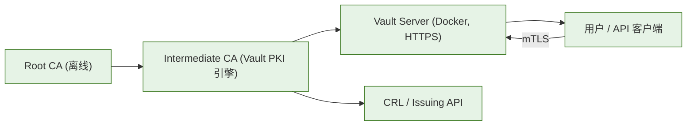
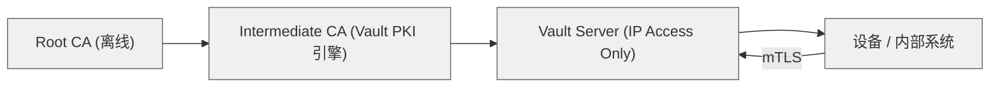

# 📘 卷 05：WiseFido_CA_方案对比与选型说明

---

## 🧭 5.1 文档目的

本卷旨在对比三种可行的 WiseFido CA 系统部署架构：

- **方案 A**：公网域名 + Nginx + Let's Encrypt + Docker + 自建 Root/Intermediate CA
- **方案 B**：公网域名 + Vault 原生 HTTPS + Docker + 自建 Root/Intermediate CA
- **方案 C**：IP + Vault 原生 HTTPS + Docker + 自建 Root/Intermediate CA

并结合技术性能、安全、可维护性与合规性四个维度进行综合分析，确定 WiseFido 的最终推荐方案。

---

## 🧱 5.2 三种方案架构对比表

| 项目                        | 方案 A                                        | 方案 B                           | 方案 C                                  |
| --------------------------- | --------------------------------------------- | -------------------------------- | --------------------------------------- |
| **架构组成**          | Nginx 反向代理 + Let's Encrypt + Docker Vault | Vault 原生 HTTPS + Docker        | Vault 原生 HTTPS + Docker（无域名）     |
| **访问方式**          | 域名（https://ca.wisefido.work）              | 域名（https://ca.wisefido.work） | 直接使用公网 IP（https://23.170.40.60） |
| **HTTPS 证书来源**    | 公共 CA (Let's Encrypt, 90天)                 | 自建 Intermediate 签发           | 自建 Intermediate 签发                  |
| **TLS 终端**          | Nginx 层                                      | Vault 内置 HTTPS 监听            | Vault 内置 HTTPS 监听                   |
| **Root/Intermediate** | 自建                                          | 自建                             | 自建                                    |
| **CRL/OCSP 支持**     | Nginx 代理转发                                | Vault 原生 API                   | Vault 原生 API                          |
| **证书续期**          | 需定期续签 Let's Encrypt                      | 自控周期（最长5年）              | 自控周期（最长5年）                     |
| **域名依赖**          | 必须（LE验证）                                | 必须（访问简化）                 | 不需要                                  |
| **部署复杂度**        | ★★★★✘                                    | ★★✔                           | ★✔                                    |
| **安全边界**          | 双层（Nginx+Vault）                           | 单层（Vault）                    | 单层（Vault）                           |
| **延迟性能**          | 有额外反代开销                                | 原生直连更快                     | 原生直连更快                            |
| **维护成本**          | 高（双配置+续签）                             | 低（自动化脚本）                 | 低（但使用体验差）                      |
| **IoT 支持度**        | ⚠ 中等（需信任LE根）                         | ✔ 高（设备信任自建CA）          | ⚠ 一般（验证链需嵌Root）               |
| **合规扩展性**        | ✔ 可通过域名延伸到云                         | ✔ 可兼容 Google CAS             | ⚠ 受限                                 |
| **推荐度**            | ⚠ 一般                                       | ★★★★★ 推荐                  | ⚠ 低                                   |

---

## 🧩 5.3 各方案结构图

### 方案 A：公网域名 + Nginx + Let's Encrypt + Docker + 自建 Root/Intermediate CA

### 方案 B：公网域名 + Vault 原生 HTTPS + Docker + 自建 Root/Intermediate CA

### 方案 C：IP + Vault 原生 HTTPS + Docker + 自建 Root/Intermediate CA

---

## ⚙️ 5.4 技术与安全分析

| 分析维度                    | 方案 A                            | 方案 B                      | 方案 C                   |
| --------------------------- | --------------------------------- | --------------------------- | ------------------------ |
| **安全性**            | 较高（双层TLS）但依赖LE外部信任链 | 高（内控Root+Intermediate） | 高（但Root链需嵌入设备） |
| **可维护性**          | 差，需续签+双层配置               | 优，自动化脚本管理          | 优，但操作性差           |
| **可移植性**          | 一般，LE绑定域名                  | 优，支持多环境              | 优，域名独立             |
| **IoT 兼容性**        | 中，需设备信任外部CA              | 优，自建信任链              | 一般，设备验证复杂       |
| **部署复杂度**        | 高                                | 低                          | 低                       |
| **性能与响应**        | 稍慢（反代+TLS双层）              | 快（原生TLS）               | 快（原生TLS）            |
| **域名访问**          | 必须，公网验证                    | 必须，简化部署              | 非必需，IP直连           |
| **最佳用途**          | Web服务+外部兼容                  | IoT、混合系统、云对接       | 封闭内网系统             |
| **Vault 集成度**      | 中等（外部TLS终端）               | 极高（原生HTTPS）           | 极高                     |
| **总体评分（5分制）** | 3.2                               | ⭐**4.8 推荐方案**    | 3.5                      |

---

## 🧮 5.5 IoT 场景兼容性分析

| 项目                      | 说明                          | 方案 A                  | 方案 B               | 方案 C                    |
| ------------------------- | ----------------------------- | ----------------------- | -------------------- | ------------------------- |
| 设备端是否能验证域名证书  | IoT 固件内置 Root             | ✔（若信任LE）          | ✔（自建Root）       | ✘（无域名）              |
| 双向认证 (mTLS)           | IoT → Server & Server → IoT | ⚠ 设备信任外部CA不稳定 | ✔ 设备内嵌自建 Root | ⚠ IP证书验证需强制CN匹配 |
| Root 内嵌策略             | Root CA 烧录在 Flash ROM      | ✔                      | ✔                   | ✔                        |
| 设备自动更新 Intermediate | OTA 支持                      | ⚠ 需外部验证           | ✔ Vault API 提供    | ⚠ 无域名访问不便         |
| CRL 分发                  | Vault 原生 API                | ⚠ 需反代配置           | ✔ 原生提供          | ✔ 原生提供               |
| 总体适配度                | IoT 大规模部署                | ⚠ 一般                 | ★★★★★ 推荐      | ⚠ 一般                   |

---

### 📘 5.6 合规与运营风险比较

| 合规要求               | 方案 A                              | 方案 B                  | 方案 C        |
| ---------------------- | ----------------------------------- | ----------------------- | ------------- |
| **HIPAA 合规性** | ⚠ 较难审计（Let's Encrypt 外部链） | ✔ Vault 审计日志全内控 | ✔ Vault 内控 |
| **审计追踪**     | 外部ACME不可追踪                    | ✔ Vault PKI 内部可溯源 | ✔            |
| **隐私保护**     | 证书外部验证链暴露                  | ✔ 全链路内部自签       | ✔            |
| **跨境数据合规** | ⚠ 受限                             | ✔ 支持区域化           | ⚠            |
| **长期可维护性** | ⚠ 短期证书易失效                   | ✔ 自控周期长           | ✔ 自控周期长 |
| **厂商独立性**   | ⚠ 依赖 Let's Encrypt               | ✔ 完全独立             | ✔ 完全独立   |

---

### 💡 5.7 技术选型结论

#### 经过综合比较，WiseFido CA 系统确定采用 方案 B：公网域名 + Vault 原生 HTTPS + Docker + 自建 Root/Intermediate CA。

#### ✅ 选择理由：

#### * 安全性最高：自控 Root & Intermediate 体系，审计可追踪。

#### * 维护成本低：Vault 原生 HTTPS，无需 Nginx 双层配置。

#### * 性能优越：减少反代层，通信路径最短。

#### * IoT 兼容性最佳：设备可直接验证 Root 链，无需外部 CA。

#### * 合规可控：满足 HIPAA 内控要求。

#### * 后续扩展性强：易迁移至 Google Cloud CAS 作为上级 Subordinate CA。

---

### 🔍 5.8 与 Google Cloud CAS 对接展望

| 对接方式                | 状态 | 说明                                   |
| ------------------- | -- | ------------------------------------ |
| Root 仍由 WiseFido 保持 | ✔  | 保持独立信任锚                              |
| Intermediate 上云     | ✔  | 可迁移为 Google CAS Managed Intermediate |
| Vault 作为下游节点        | ✔  | 提供本地签发接口                             |
| IoT 设备信任链           | ✔  | 仍以内置 Root 验证                         |
| 审计与生命周期             | ✔  | Google CAS + Vault 双日志合规             |

---

### ✅ 5.9 结论摘要表

| 维度      | 最优方案 | 评分  |
| ------- | ---- | --- |
| 技术性能    | 方案 B | 4.9 |
| 安全合规    | 方案 B | 5.0 |
| IoT 支持度 | 方案 B | 5.0 |
| 成本与维护   | 方案 B | 4.8 |
| 云兼容性    | 方案 B | 4.9 |

---

### 📘 最终推荐方案：
### 方案 B — 公网域名 + Vault 原生 HTTPS + Docker + 自建 Root/Intermediate CA

---

编制人： WiseFido 系统架构组
审核人： Chief Security Officer
批准人： WiseFido Engineering Director
发布日期： 2025-10-05
