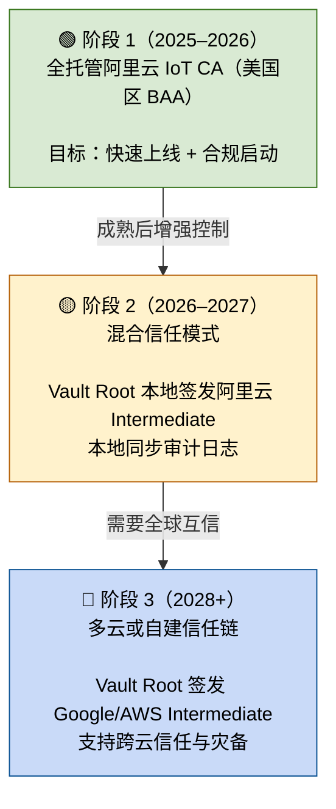

# 📘 卷 07：WiseFido_CA_未来演进与可持续信任蓝图（v1.3）

**发布日期：2025-10-06**
**编制单位：WiseFido Security & Compliance Group**

---

## 🧭 7.1 文档定位

本卷为 **WiseFido CA 体系的未来分支 (Cloud Branch)**，
用于规划在不改动主线（卷 00–06 基于 Vault 的本地自建 CA 体系）的前提下，
评估引入 **阿里云 IoT CA （美国区 BAA 签署）** 作为云托管备选路线的可行性。

本卷不替代、也不修改任何现有部署脚本或文件规范，
而是提供未来 3–5 年的 **战略演进蓝图**——
为现在留稳态，为未来留出口，为长期合规保主权。

### 🌐 分支声明 (Cloud Branch Declaration)

- **主线不变**：卷 00 至 卷 06 的 Vault Root + Intermediate 架构仍是当前生产与合规基线。
- **本卷为未来分支**：聚焦“阿里云 IoT CA 全托管（美国区 BAA）”方案的长期规划与风险评估。
- **并行不冲突**：该蓝图与现有自建 CA 体系可并行存在，不互相覆盖。
- **可回退**：若实施云托管试点，须保留 Vault Root 作为离线信任锚与审计副本，确保主权可恢复。
- **范围说明**：
  - **Scope**：云托管 CA 的阶段策略、合规路线、回退机制。
  - **Out-of-Scope**：不改动卷 00–06 的部署架构、命令或命名规范。

---

## 🧩 7.2 现状回顾（主线与未来分支对比）

### 🔹 当前主线（Local Vault 体系）

卷 00–卷 06 所定义的 WiseFido 自建 Root/Intermediate CA 架构，基于 **HashiCorp Vault** 实现，具备以下特点：

- Root Key 与签发权限完全由 WiseFido 控制；
- 所有证书签发、吊销、审计日志可本地追溯；
- 完全符合 HIPAA 的可追踪性与最小外包原则；
- 部署位置位于美国本地服务器，数据主权清晰。

该架构已通过验证，能够支持医疗 IoT 设备的全流程身份认证与通信加密，
是当前生产运行与合规审计的基线方案。

---

### 🔹 未来分支（阿里云 IoT CA 全托管架构）

为降低维护成本与实现更高规模设备管理，
WiseFido 评估了 **阿里云 IoT CA（美国区 BAA 签署）** 的可行性。
该架构由阿里云提供完整的 CA 托管服务，包括 Root 管理、证书签发、自动续期与吊销。
在合规层面，美国区阿里云支持签署 **Business Associate Agreement (BAA)**，
从而满足 HIPAA 对受保护健康信息 (PHI) 处理的合法要求。

**优点：**

- 部署简化，无需自建 Vault；
- 自动化证书管理，适合大规模设备；
- 阿里云美国区具备 BAA 支持，可用于医疗合规场景；
- 审计与日志可通过 API 获取。

---

### ⚠️ 需关注的风险与局限

尽管阿里云 IoT CA（美国区）提供便利与合规能力，但 WiseFido 在技术与政策层面需注意以下潜在局限：

| 风险类型                   | 描述                                                                            | 应对策略                                         |
| -------------------------- | ------------------------------------------------------------------------------- | ------------------------------------------------ |
| **Root 控制权缺失**  | Root Key 由阿里云托管，客户无法导出或再签                                       | 保留 Vault Root 离线信任锚，确保主权可恢复       |
| **迁移困难**         | 所有设备证书绑定阿里云 Root，迁移到其他云需重新注册                             | 设计双信任链（Vault Root + Aliyun Intermediate） |
| **审计访问受限**     | 云端日志访问需通过阿里云账户 API，HIPAA 审计需额外授权                          | 定期导出签发日志至本地存档                       |
| **跨境数据监管风险** | 尽管美国区运营主体为 Alibaba Cloud (US) LLC，但母公司位于中国，存在潜在政策牵连 | 将设备与数据均限制在美国区服务，避免跨境依赖     |
| **合规边界不一致**   | BAA 仅适用于美国区服务，其他区域不自动涵盖                                      | 业务及数据处理必须全部在 US East/West 区域完成   |

---

### 🔹 小结

> 阿里云 IoT CA（美国区 BAA）方案在功能与合规上具有一定吸引力，
> 但从架构控制与监管角度看，其作为 **未来并行分支（Cloud Branch）** 更为稳妥。
> 当前主线（Vault 本地 CA）仍是 WiseFido 的生产与合规基石，
> 云托管架构应仅在具备明确退路与离线审计机制的前提下试行。

---

## 🧱 7.3 设计原则

| 原则                 | 描述                          | 意图                 |
| -------------------- | ----------------------------- | -------------------- |
| **最简上线**   | 先以阿里云 IoT CA 启动业务    | 避免过早复杂化       |
| **主权可恢复** | Root 虽暂托管，但未来可重建   | 防止锁死             |
| **合规前置**   | BAA 签署与 HIPAA 日志追溯保障 | 医疗市场可用         |
| **演进可控**   | 每个阶段都有可回退出口        | 符合安全架构设计理念 |
| **审计对称**   | 云端有日志，本地留副本        | 防止单点依赖         |

---

## 🧭 7.4 三阶段演进模型（WiseFido 自定义）

> ⚙️ 说明：以下演进模型为 WiseFido 内部定义，
> 非阿里云官方文档内容。
> 其目标是确保在采用云托管的同时，
> 保持 Root 主权与跨云迁移的可能性。

| 阶段                     | 时间范围   | 模式                                                 | 控制权   | 主要目标                        |
| ------------------------ | ---------- | ---------------------------------------------------- | -------- | ------------------------------- |
| **阶段 1（当前）** | 2025–2026 | 阿里云 IoT CA 全托管                                 | 云端     | 快速上线 + HIPAA BAA 合规       |
| **阶段 2（中期）** | 2026–2027 | 混合信任模式（Vault Root + 阿里云 Intermediate）     | 部分本地 | 增强 Root 主权 + 审计副本本地化 |
| **阶段 3（远期）** | 2028+      | 多云或自建信任模式（Vault Root + Google CAS/AWS CA） | 完全自控 | 全球扩展 + 可迁移信任链         |

---

## 🔐 7.5 三阶段演进图（生命周期蓝图）

---

## ⚙️ 7.6 各阶段架构对比

| 项目          | 阶段 1：全托管    | 阶段 2：混合模式        | 阶段 3：多云信任     |
| ------------- | ----------------- | ----------------------- | -------------------- |
| Root CA       | 阿里云 Root       | Vault Root              | Vault Root           |
| 中级 CA       | 阿里云 IoT CA     | 阿里云 IoT Intermediate | Google CAS / AWS CA  |
| 证书签发      | 阿里云托管        | 阿里云托管              | 多云协同             |
| Root Key 控制 | 阿里云            | WiseFido                | WiseFido             |
| 审计日志      | 云端 CloudMonitor | 云+本地同步             | 本地完全控制         |
| 合规性        | HIPAA (BAA)       | HIPAA (BAA + Local Log) | HIPAA + SOC2/HITRUST |
| 演进难度      | 低                | 中                      | 高                   |
| 推荐用途      | 快速上线          | 稳定期、医疗级项目      | 全球扩展或多云协同   |

---

## 🧩 7.7 风险与回退机制

| 风险                             | 阶段影响  | 应对策略                             |
| -------------------------------- | --------- | ------------------------------------ |
| 平台政策变化（云停服或管辖变更） | 阶段 1    | 启用 Vault Root，重签新 Intermediate |
| Root Key 外部不可导出            | 阶段 1–2 | 保留 Vault Root 作为替代锚           |
| 审计查询受限                     | 阶段 1    | 建立 API 日志同步到本地服务器        |
| 医疗监管变化（HIPAA 审计延伸）   | 阶段 2    | 本地化日志 + 定期导出合规报告        |
| 多云互信复杂性                   | 阶段 3    | 通过统一 Vault Root 保持信任锚稳定   |

---

#### 🧠 7.8 为什么要有演进模型

#### “全托管阿里云 IoT CA” 在官方定位上是托管服务，

#### 没有迁移或自控设计。

#### 但对于 WiseFido 这样的医疗物联网体系来说，

#### 控制权与审计留存是合规的生命线。

#### 因此，WiseFido 定义此三阶段模型，

#### 是为了确保：

1. **云托管不是终点，而是合规起点；**
2. **未来如政策或业务变化，仍有可迁出口；**
3. **Root Key 与签发日志始终在公司主权下可再生、可验证**

---

## 📊 7.9 未来三年行动路线（执行摘要）

| 年份                 | 关键目标             | 主要行动                                |
| -------------------- | -------------------- | --------------------------------------- |
| **2025–2026** | 上线与合规启动       | 使用阿里云 IoT CA（美国区 BAA）         |
| **2026–2027** | 主权增强与日志本地化 | 启用 Vault Root，建立同步管控           |
| **2028+**      | 多云信任扩展         | 准备 Google CAS / AWS Intermediate 接口 |

---

## 7.9 bis 分支定位说明

本卷（Cloud Branch）仅代表 WiseFido CA 体系的未来方向。
当前生产与合规体系仍以卷 00–06 的 Vault Root/Intermediate 自建 CA 为主线。
当云托管 BAA 模式成熟并经安全审计批准后，
可逐步平行启用本蓝图所述的阶段 1 （阿里云 IoT CA 全托管）架构。
本卷的实施与否，不影响现有系统运行。

---

## ✅ 7.10 总体结论 （Cloud Branch 战略分支结论）

**WiseFido CA 系统演进路线 = 简化部署 × 保留主权 × 可持续合规。**

**在当前阶段（全托管阿里云 IoT CA 模式），系统可快速上线并满足 HIPAA 要求；
在中期阶段，可引入 Vault Root 保留控制权与审计能力；
在长期阶段，可向 Google / AWS 等多云扩展，建立全球化信任体系。**

**此蓝图确保：**

**合规不被动（HIPAA / BAA / 审计链条完整）**

**主权可恢复（Root 与签发可再生）**

**架构可持续（支持未来迁移与信任协同）**

> 本结论适用于 Cloud Branch 分支规划；主线 Vault 体系仍按卷 06 执行。

---

编制人： WiseFido 合规与安全团队
审核人： Chief Security Officer
批准人： WiseFido Engineering Director
发布日期： 2025-10-05
