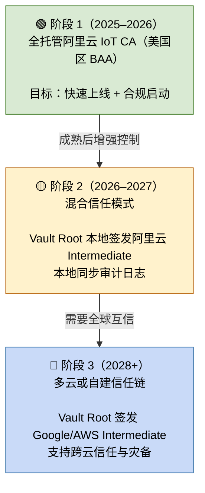

# 📘 卷 07：WiseFido_CA_未来演进与可持续信任蓝图（v1.2）

**发布日期：2025-10-05**
**编制单位：WiseFido Security & Compliance Group**

---

## 🧭 7.1 文档定位

本卷旨在定义 **WiseFido CA 体系的长期演进路线**，确保在采用“阿里云 IoT CA（美国区）全托管模式”的基础上，依然具备未来的安全扩展与可迁移能力。

> 💡 换句话说：
> 卷 07 不是新部署方案，而是 WiseFido 的 CA 演进蓝图——
> 它为未来留出口，为现在定稳态，为长期合规留主权。

---

## 🧩 7.2 当前状态与基础架构

### 🔹 当前采用架构（2025）

- **模式**：全托管阿里云 IoT CA（美国区）
- **Root 管理**：由阿里云托管
- **合规状态**：符合 HIPAA（签署 BAA）
- **审计**：阿里云提供 CloudMonitor / API 日志
- **信任链控制权**：阿里云为主导

### 🔹 当前设计目标

1. 快速实现 IoT 设备安全上线
2. 满足 HIPAA 合规要求（BAA）
3. 保留未来自有 Root 或多云扩展能力

---

## 🧱 7.3 设计原则

| 原则                 | 描述                          | 意图                 |
| -------------------- | ----------------------------- | -------------------- |
| **最简上线**   | 先以阿里云 IoT CA 启动业务    | 避免过早复杂化       |
| **主权可恢复** | Root 虽暂托管，但未来可重建   | 防止锁死             |
| **合规前置**   | BAA 签署与 HIPAA 日志追溯保障 | 医疗市场可用         |
| **演进可控**   | 每个阶段都有可回退出口        | 符合安全架构设计理念 |
| **审计对称**   | 云端有日志，本地留副本        | 防止单点依赖         |

---

## 🧭 7.4 三阶段演进模型（WiseFido 自定义）

> ⚙️ 说明：以下演进模型为 WiseFido 内部定义，
> 非阿里云官方文档内容。
> 其目标是确保在采用云托管的同时，
> 保持 Root 主权与跨云迁移的可能性。

| 阶段                     | 时间范围   | 模式                                                 | 控制权   | 主要目标                        |
| ------------------------ | ---------- | ---------------------------------------------------- | -------- | ------------------------------- |
| **阶段 1（当前）** | 2025–2026 | 阿里云 IoT CA 全托管                                 | 云端     | 快速上线 + HIPAA BAA 合规       |
| **阶段 2（中期）** | 2026–2027 | 混合信任模式（Vault Root + 阿里云 Intermediate）     | 部分本地 | 增强 Root 主权 + 审计副本本地化 |
| **阶段 3（远期）** | 2028+      | 多云或自建信任模式（Vault Root + Google CAS/AWS CA） | 完全自控 | 全球扩展 + 可迁移信任链         |

---

## 🔐 7.5 三阶段演进图（生命周期蓝图）

---

## ⚙️ 7.6 各阶段架构对比

| 项目          | 阶段 1：全托管    | 阶段 2：混合模式        | 阶段 3：多云信任     |
| ------------- | ----------------- | ----------------------- | -------------------- |
| Root CA       | 阿里云 Root       | Vault Root              | Vault Root           |
| 中级 CA       | 阿里云 IoT CA     | 阿里云 IoT Intermediate | Google CAS / AWS CA  |
| 证书签发      | 阿里云托管        | 阿里云托管              | 多云协同             |
| Root Key 控制 | 阿里云            | WiseFido                | WiseFido             |
| 审计日志      | 云端 CloudMonitor | 云+本地同步             | 本地完全控制         |
| 合规性        | HIPAA (BAA)       | HIPAA (BAA + Local Log) | HIPAA + SOC2/HITRUST |
| 演进难度      | 低                | 中                      | 高                   |
| 推荐用途      | 快速上线          | 稳定期、医疗级项目      | 全球扩展或多云协同   |

---

## 🧩 7.7 风险与回退机制

| 风险                             | 阶段影响  | 应对策略                             |
| -------------------------------- | --------- | ------------------------------------ |
| 平台政策变化（云停服或管辖变更） | 阶段 1    | 启用 Vault Root，重签新 Intermediate |
| Root Key 外部不可导出            | 阶段 1–2 | 保留 Vault Root 作为替代锚           |
| 审计查询受限                     | 阶段 1    | 建立 API 日志同步到本地服务器        |
| 医疗监管变化（HIPAA 审计延伸）   | 阶段 2    | 本地化日志 + 定期导出合规报告        |
| 多云互信复杂性                   | 阶段 3    | 通过统一 Vault Root 保持信任锚稳定   |

---

#### 🧠 7.8 为什么要有演进模型

#### “全托管阿里云 IoT CA” 在官方定位上是托管服务，

#### 没有迁移或自控设计。

#### 但对于 WiseFido 这样的医疗物联网体系来说，

#### 控制权与审计留存是合规的生命线。

#### 因此，WiseFido 定义此三阶段模型，

#### 是为了确保：

1. **云托管不是终点，而是合规起点；**
2. **未来如政策或业务变化，仍有可迁出口；**
3. **Root Key 与签发日志始终在公司主权下可再生、可验证**

---

## 📊 7.9 未来三年行动路线（执行摘要）

| 年份                 | 关键目标             | 主要行动                                |
| -------------------- | -------------------- | --------------------------------------- |
| **2025–2026** | 上线与合规启动       | 使用阿里云 IoT CA（美国区 BAA）         |
| **2026–2027** | 主权增强与日志本地化 | 启用 Vault Root，建立同步管控           |
| **2028+**      | 多云信任扩展         | 准备 Google CAS / AWS Intermediate 接口 |

---

## ✅ 7.10 总体结论

**WiseFido CA 系统演进路线 = 简化部署 × 保留主权 × 可持续合规。**

**在当前阶段（全托管阿里云 IoT CA 模式），系统可快速上线并满足 HIPAA 要求；
在中期阶段，可引入 Vault Root 保留控制权与审计能力；
在长期阶段，可向 Google / AWS 等多云扩展，建立全球化信任体系。**

**此蓝图确保：**

**合规不被动（HIPAA / BAA / 审计链条完整）**

**主权可恢复（Root 与签发可再生）**

**架构可持续（支持未来迁移与信任协同）**

---

编制人： WiseFido 合规与安全团队
审核人： Chief Security Officer
批准人： WiseFido Engineering Director
发布日期： 2025-10-05