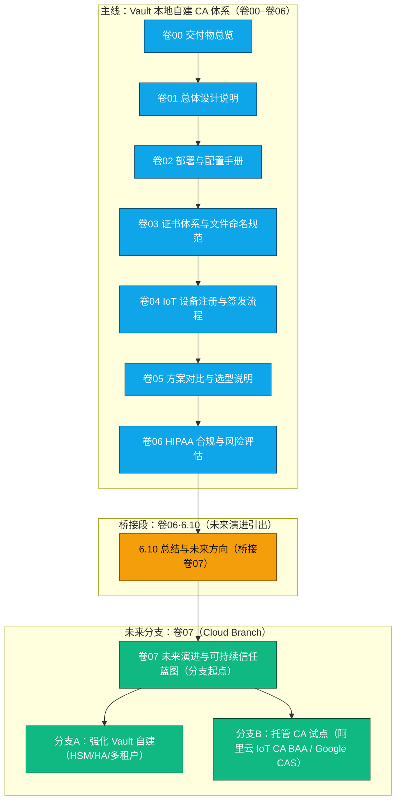

# WiseFido CA 设计与实施（GitHub 仓库总览）

> 面向工厂生产与机构部署的 IoT 证书体系：以 **HashiCorp Vault** 为核心的本地 CA（方案 B），并规划向 **公有云托管 CA** 的可演进路线（卷 07）。


---

## 目录（Table of Contents）

- [1. 本仓库定位](#1-本仓库定位)
- [2. 文档与脚本分卷体系](#2-文档与脚本分卷体系)
- [3. 卷 06 ⇄ 卷 07 桥接关系（Mermaid）](#3-卷-06--卷-07-桥接关系mermaid)
- [4. 快速上手（方案 B 基线）](#4-快速上手方案-b-基线)
- [5. 典型使用场景与建议路径](#5-典型使用场景与建议路径)
- [6. 变更与版本规范](#6-变更与版本规范)
- [7. 贡献与评审流程](#7-贡献与评审流程)

---

## 1. 本仓库定位

- **目标读者**：WiseFido 内部工程团队（工厂侧/平台侧/合规模块）。
- **落地范围**：以 **方案 B：公网域名 + Vault 原生 HTTPS + Docker + 自建 Root/Intermediate CA** 为当前生产基线；并在 **卷 07** 描述可持续信任蓝图与**分支式演进**（含云托管 CA 选项）。
- **不偏离前文**：卷 00–卷 06 聚焦“本地部署与自建 CA”；卷 07 作为“未来演进”**分支起点**，**不推翻**既有基线。

---

## 2. 文档与脚本分卷体系

> **编号一经确认即长期沿用**，所有新增仅在不破坏既定编号的前提下追加 **补丁块** 或 **子章节**。


## 解读

* ### 卷 06 在完成法规与风险评估后，通过 6.10 桥接段 给出分支化建议；
* ### 卷 07 作为**“未来演进”单独分支**的起点，不反向覆盖卷 00–卷 06 的设计与落地；
* ### 分支 A 继续打磨自建 CA；分支 B 评估与试点托管 CA（保持 BAA/HIPAA 决策门槛）。

---

## 4. 快速上手（方案 B 基线）

### 详细步骤以 卷 02 为准，以下为“最快可用”的骨架清单：

**1.前置条件**

* Ubuntu Server 24.04 x86_64
* 公网域名：ca.wisefido.work（A 记录指向 23.170.40.60）
* Docker & Docker Compose 已安装

**2.关键文件就位**

* 02_docker/01_docker-compose.yml
* 02_config/01_vault.hcl
* 02_scripts/01~07_*.sh（按编号执行）

**3.一键启动（示例）**

```bash
cd 02_WiseFido_CA_部署与配置手册.md 同级目录/02_docker
docker compose up -d
../02_scripts/01_setup_init_vault.sh
../02_scripts/02_setup_unseal_vault.sh
../02_scripts/03_setup_generate_root_ca.sh
../02_scripts/04_setup_create_intermediate_ca.sh
../02_scripts/05_setup_configure_https.sh
../02_scripts/06_setup_test_and_validate.sh
../02_scripts/07_setup_device_role.sh
```

## 4.验证点

* **curl -v https://ca.wisefido.work:8200：证书链、主机名匹配通过**
* **Vault pki_int 可签发 Server/Client 证书；CRL/OCSP 配置与审计日志可**

---

## 5.典型使用场景与建议路径

* 工厂烧录/注册：按 卷 04 的 CSR → 签发 → 证书回写规范执行。
* 生产可运维：参考 卷 02 脚本 06_* 做体检校验。
* 合规审计：以 卷 06 清单对照，留存审计轨迹（签发/吊销/访问）。
* 向云托管试点：遵循 卷 06 · 6.10 桥接段 与 卷 07 的“分支 B”试点路线，先沙箱后灰度，前置 BAA/数据位移评估。

## 6. 变更与版本规范

- **卷 00–卷 06**：仅通过 **补丁块（patches）** 方式增量修订（例如新增 `6.10`），**编号不变更**。
- **卷 07**：作为独立的“Cloud Branch 分支”文档，可随演进小版本迭代（`v1.1`、`v1.2`、`v1.3`…），但不得回写覆盖基线文档。
- 所有目录与文件名**保持编号稳定**，新增内容仅以“补丁”或“子文件”形式扩展。
- 所有合规修改必须更新到 **卷 00** 的交付物总览表中，并在 `README.md` 顶部标明版本号与日期。

---

## 7. 贡献与评审流程

### 📘 7.1 工作流

1. **建议以 Issue + Pull Request 驱动**。每个 PR 必须说明影响范围（卷号/脚本/合规点）。
2. **涉及安全核心的变更**（Root、Intermediate、吊销策略）必须 **双人复核 + 审计登记**。
3. **云托管 CA 分支相关修改**需附带：
   - BAA 签署状态说明；
   - 数据驻留（Data Residency）确认；
   - 卷 07 风险对照表引用。

### 📘 7.2 命名规范与提交信息

- 分支命名：`feature/卷号_功能名` 或 `fix/卷号_问题简述`示例：`feature/07_add_cloud_branch_model`
- 提交信息（Commit Message）建议结构：

**[卷号] 修改内容**
**[说明] 原因与影响范围**
**[审计] 是否涉及 Root/证书策略**

- 如涉及文档同步，请在 PR 描述中说明是否影响 “桥接图” 或 “README”。

---

## 🔄 附录：主线与分支演进关系（结构总览）



**图示说明**

* 卷 06 结束时通过 6.10 补丁自然衔接未来演进；
* 卷 07 为 Cloud Branch 起点，评估阿里云 IoT CA（美国区 BAA）等托管化方案；
* 两条路径（本地主线 / 云分支）并行存在，互不覆盖，保持可回退性。

---

## 📜 项目版本信息

| 项目组件                | 当前版本   | 状态        | 维护者              |
| ----------------------- | ---------- | ----------- | ------------------- |
| Vault 自建 CA 主线      | v1.2       | ✅ 生产运行 | WiseFido Infra Team |
| 卷 06 HIPAA 风险评估    | v1.2       | ✅ 审计通过 | Compliance Group    |
| 卷 07 Cloud Branch 蓝图 | v1.3       | 🧭 规划中   | Security & Strategy |
| 本 README               | 2025-10-06 | ✅ 最新同步 | Docs Maintainer     |

---

## 🧠 总结说明

### 📘 主线与分支并行存在：

* 卷 00–卷 06 = 当前生产可落地的 Vault 自建 CA 架构；
* 卷 07 = 未来分支（Cloud Branch），规划在 阿里云 IoT CA（美国区 BAA） 或 Google CAS 托管条件下的可演进路线；
* 所有文档间通过 卷 06·6.10 自然桥接，不会造成覆盖冲突。

## 📎 设计哲学：

* 本地 Root 保主权；
* 云端托管看合规；
* 结构清晰、阶段分明、可回退、可扩展。

  ---

  维护者：WiseFido 合规与安全团队
  最后更新：2025-10-06
